```{r}
#| label: make summary from data
#| include: false
#| echo: false
#| eval: true
#| warning: false
#| message: false

# #This is just here to show how the summaries for df_pt and df1 were done
# df <- read.csv("V:/ARU/SENSR-BAT/NABat/2024/Processed_V2/AK/Combined.csv")
# keep_grids <- c(18318, 206, 47310)  # Wrangell, POW, Ketchikan have actual confirmed MYVO. Any other grids need to get MYVO tags downgraded
# 
# df <- df %>%
#   mutate(
#     Final.Species.ID = if_else(
#       Final.Species.ID == "MYVO" & !(GRTS.Cell.ID %in% keep_grids),
#       "MYLUMYVO",
#       Final.Species.ID
#     )
#   )
# 
# #Drop codes fro site maps
# drop_codes <- c("NOISE", "FB")
# 
# unid_codes <- c("NOID")  #clarify that this is not a species code
# # Keeps individual clock times (df1 is aggregated and can't).
# df_pts <- df %>%
#   filter(!is.na(Final.Species.ID)) %>%
#   mutate(ts = as.POSIXct(Timestamp, format = "%Y-%m-%d %H:%M", tz = "UTC")) %>%
#   transmute(species_raw = Final.Species.ID, SiteName, ts) %>%
#   separate_rows(species_raw, sep = "\\s*,\\s*") %>%
#   mutate(species = toupper(trimws(species_raw))) %>%
#   filter(!species %in% drop_codes, species != "", !is.na(ts)) %>%
#   mutate(
#     Site_key   = tolower(trimws(SiteName)),
#     hr         = as.numeric(format(ts, "%H")) + as.numeric(format(ts, "%M")) / 60,
#     nh         = ifelse(hr < 12, hr + 24, hr),               # wrap post-midnight past 24 so 0:00 sits above 23:00
#     night_date = as.Date(ts - 12 * 3600),                    # dusk-to-dawn pooled onto one date (same rule as df1)
#     x          = as.Date(paste0("2001-", format(night_date, "%m-%d"))),  # season-normalised, overlays years
#     facet = ifelse(nchar(species) > 4 | species %in% unid_codes, "Unidentified", species)     # your >4-char rule plus NoID
#   )
# 
# # species <- Final.Species.ID   Site <- CellName   date <- Timestamp   year <- Year
# df1 <- df %>%
#   filter(!is.na(Final.Species.ID)) %>%
#   mutate(rec_id = row_number()) %>%       # one row of df == one recording
#   transmute(
#     rec_id,
#     species_raw = Final.Species.ID,
#     Site        = SiteName,
#     date = as.Date(as.POSIXct(Timestamp, format = "%Y-%m-%d %H:%M", tz = "UTC") - 12 * 3600),     # For biological "nights" (pool dusk-to-dawn onto one date)
#     year        = Year
#   ) %>%
#   # A recording with two or more bats, e.g. "MYLU,LANO", becomes one row per
#   # species so each identified species is counted (not lumped into a combo code).
#   separate_rows(species_raw, sep = "\\s*,\\s*") %>%
#   mutate(species = toupper(trimws(species_raw))) %>%
#   filter(!species %in% drop_codes) %>%    # removes Noise, FB, blanks, junk buckets
#   count(species, year, date, Site, name = "n_files")
# 
# write.csv(df_pts,"Data/hourlySppDetection-2024.csv")
# write.csv(df1, "Data/dailytotaldetection-2024.csv")

# species_cols  <- c("LACI","LANO","MYCA","MYEV","MYLU","MYVO","MYYU")
# species_order <- c("LACI","LANO","MYCA","MYEV","MYLU","MYVO","MYYU")
# loc_order <- c("Yakutat","Juneau","Douglas","Hoonah","Sitka",
#                "Petersburg","Wrangell","POW","Ketchikan")
# 
# plot_df <- bat.data.5yr %>%
#   dplyr::distinct(GRTS.Cell.ID, Quadrant, Night, .keep_all = TRUE) %>%   # one row / detector-night
#   dplyr::select(Name, Year, dplyr::all_of(species_cols)) %>%
#   tidyr::pivot_longer(dplyr::all_of(species_cols),
#                       names_to = "Species", values_to = "Calls") %>%
#   dplyr::group_by(Name, Year, Species) %>%
#   dplyr::summarise(Calls = sum(Calls, na.rm = TRUE), .groups = "drop")
# 
# name_levels <- c(intersect(loc_order, unique(plot_df$Name)),
#                  setdiff(unique(plot_df$Name), loc_order))          # keep any extras, don't drop
# 
# plot_df <- plot_df %>%
#   dplyr::mutate(
#     Species = factor(Species, levels = species_order),
#     Name    = factor(Name,    levels = name_levels)
#   )
# write.csv(plot_df,"Data/yearlyspptotal.csv")
```

```{r}
#| label: Load packages and summary data for 2024 and 2025
#| include: false
#| echo: false
#| eval: true
#| warning: false
#| message: false

library(dplyr)
library(tidyr)
library(readr)
library(gt)
library(leaflet)
library(htmltools)
library(base64enc)
library(flextable)
library(kableExtra)
library(knitr)
library(ggplot2)
library(htmltools)
library(sf)
library(lubridate)
library(stringr)
#set these so that the document can render both html and pdf
is_html <- knitr::pandoc_to("html")
is_pdf  <- !is_html

#Need to specify figure captions based on the rendering type (PDF or HTML)
cap_sitesummary <- paste0(
  "Acoustic bat monitoring sites in Alaska in 2025.",
  "NABat grid cells monitored (with two or more stationary sites) in 2025 appear in red and those monitored in 2024 in orange. Cells monitored in previous years but not in 2024 or 2025 appear in grey.",
  if (is_html) paste0(
    "Zooming in shows monitoring sites (blue circles) within each grid cell. Clicking any site opens a summary of species detections, including a pie chart of total detections by species code, bar chart of means of daily detection totals, and figure with hourly detections by species."
  ) else ""
)

#load summary and trend model data
sites <- read.csv("Data/Sites2025.csv")
df_pts <- read.csv("Data/hourlySppDetection.csv")
df_pts$x <- ymd(df_pts$x)
df_pts$night_date <- ymd(df_pts$night_date)
df_pts$ts <- ymd_hms(df_pts$ts)
df1 <- read.csv("Data/dailytotaldetection.csv")
df1$date <- ymd(df1$date)

grids <- st_read("Data/AK_GRTS10km_GridsSampled2025.shp", quiet = TRUE)
grids <- st_transform(grids, 4326)
grids$border_col <- dplyr::case_when(
  grids$LastYSamp == 2024 ~ "#ff7f00",   # orange
  grids$LastYSamp == 2025 ~ "#e31a1c",   # red
  TRUE                   ~ "#999999"    # grey (any other year / NA)
)

#add common grid cell name
cell_name_vec <- sites %>%
  dplyr::filter(!is.na(GridCellName), nzchar(trimws(GridCellName))) %>%
  dplyr::transmute(
    key  = trimws(as.character(GRTS.Cell.Id)),   # read.csv form of "GRTS Cell Id"
    name = trimws(GridCellName)
  ) %>%
  dplyr::distinct(key, .keep_all = TRUE)

grids$CellName <- cell_name_vec$name[
  match(trimws(as.character(grids$GRTS_ID)), cell_name_vec$key)
]

#--------------Clean up data to create site map------------
# ---- 0. Settings -----------------------------------------------------------
# Fixed colour per species so every pie is consistent.
# Unknown codes fall back to grey via pal_get().
species_pal <- c(
  LACI = "#7570b3", LANO = "#e7298a",
  MYEV = "#e6ab02", `40KMYO` = "#1f78b4",
  MYLU = "#a6cee3", MYVO = "#b2df8a", MYYU = "#fb9a99",
  MYCA = "#1b9e77", MYSE = "#cab2d6"
)

pal_get <- function(nm) {
  v <- unname(species_pal[nm])
  ifelse(is.na(v), "#bbbbbb", v)
}

# Fixed colour per YEAR (matches the GRTS cell legend: 2024 orange, 2025 red)
year_cols <- c(`2024` = "#ff7f00", `2025` = "#e31a1c")
plot_years <- as.integer(names(year_cols))

# ---- 0a. Per-detection frame for the hour-facet plot -----------------------
# Shared axes across every popup, so panels are comparable site to site
hour_xlim <- range(df_pts$x,  na.rm = TRUE)
hour_ylim <- range(df_pts$nh, na.rm = TRUE)

# ---- 0b. Build night x site x species detection counts from raw df ---------

# Species actually present drive the pies/legend (nothing is silently dropped).
target_species <- sort(unique(df1$species))

# ---- 1. Site table (from Sites2025.csv) ------------------------------------
map_sites <- sites %>%
  filter(!is.na(Location.Name), Location.Name != "") %>%
  transmute(
    Site     = Location.Name,
    Site_key = tolower(trimws(Location.Name)),
    Lat      = Latitude,
    Long     = Longitude,
    Comment  = NA_character_
  ) %>%
  distinct(Site_key, .keep_all = TRUE)

# ---- 2. Aggregate detections to one row per site (sum across days/years) ----
site_species <- df1 %>%
  filter(species %in% target_species) %>%
  mutate(Site_key = tolower(trimws(Site))) %>%          # <- normalized key
  group_by(Site_key, species) %>%
  summarise(total = sum(n_files, na.rm = TRUE), .groups = "drop") %>%
  pivot_wider(names_from = species, values_from = total, values_fill = 0)

for (s in setdiff(target_species, names(site_species))) site_species[[s]] <- 0
site_species <- site_species[, c("Site_key", target_species)]  # key + species cols

# ---- 2a. Per-site x year species counts (for the two pies) ------------------
site_species_year <- df1 %>%
  filter(species %in% target_species) %>%
  mutate(Site_key = tolower(trimws(Site))) %>%          # <- normalized key
  group_by(Site_key, year, species) %>%
  summarise(total = sum(n_files, na.rm = TRUE), .groups = "drop")

# helper: named count vector for one site/year (only species present)
counts_year <- function(sk, yr) {
  sub <- site_species_year[site_species_year$Site_key == sk &
                             site_species_year$year == yr, ]
  setNames(sub$total, sub$species)
}

# ---- 2b. Calendar-day totals per site x year (for the by-date tab) ----------
site_day <- df1 %>%
  filter(species %in% target_species) %>%
  mutate(Site_key = tolower(trimws(Site))) %>%          # <- normalized key
  group_by(Site_key, year, date) %>%
  summarise(night_total = sum(n_files, na.rm = TRUE), .groups = "drop") %>%
  mutate(md = format(date, "%m-%d")) %>%
  group_by(Site_key, year, md) %>%
  summarise(
    total  = sum(night_total),
    nights = n_distinct(date),
    .groups = "drop"
  ) %>%
  mutate(
    day   = as.Date(paste0("2001-", md)),
    value = total / nights
  ) %>%
  arrange(Site_key, year, day)

day_xlim <- range(site_day$day)
day_ylab <- "Recordings / night"

# ---- 3. Join detections onto the site locations ----------------------------
map_data <- map_sites %>%
  left_join(site_species, by = "Site_key") %>%
  mutate(across(all_of(target_species), ~ tidyr::replace_na(.x, 0)))


```

```{r}
#| label: Load activity model covariates and format 
#| include: false
#| echo: false
#| eval: true
#| warning: false
#| message: false

# Load the model covariates summary table
model_covariates <- read.csv("Data/Analyzed/ModelVariables.csv")
transect_covariates <- read.csv("Data/Analyzed/ModelVariables_TransectMV.csv")
#this comes from running the ModelSelection.R code where it runs all of the covariates and chooses the best model best on AIC

#format the covariates df
# Optional: clean covariate labels. Anything not listed falls back to its raw term.
cov_labels <- c(
  Percent.Clutter          = "Percent clutter",
  Water.Nearby             = "Water nearby",
  WaterDist                = "Distance to water (m)",
  Distance.to.Clutter..m.  = "Distance to clutter (m)",
  Nightly.Max.Temp         = "Nightly max temp (°C)",
  Nightly.Min.Temp         = "Nightly min temp (°C)",
  Nightly.Max.RH           = "Nightly max RH",
  Nightly.Min.RH           = "Nightly min RH",
  Nightly.Precipitation    = "Nightly precipitation (mm)",
  Nightly.Mean.Windsp      = "Nightly mean wind speed (m/s)",
  jNight                   = "Julian night"
)

# Species code to common name lookup
species_names <- c(
  LACI = "Hoary Bat",
  LANO = "Silver-haired Bat",
  MYLU = "Little Brown Myotis",
  MYYU = "Yuma Myotis",
  MYEV = "Long-eared Myotis",
  MYVO = "Long-legged Myotis",
  MYCA = "California Myotis"
)

model_covariates <- model_covariates %>%
  mutate(
    Common_Name = species_names[sp],
    Covariates = purrr::map_chr(vars, function(v) {
      parts    <- trimws(strsplit(v, ",")[[1]])
      labelled <- dplyr::coalesce(unname(cov_labels[parts]), parts)
      paste(labelled, collapse = ", ")
    })
  ) %>%
  select(Common_Name, Species_Code = sp, Covariates)

#remove these covariates since the model had too few detections to be reliable
model_covariates$Covariates[model_covariates$Species_Code %in% c("MYVO", "MYYU", "LACI")] <- "" 
model_covariates$Species_Code <- NULL

transect_covariates<- transect_covariates %>%
mutate(
 Common_Name = species_names[sp],
 Covariates = purrr::map_chr(vars, function(v) {
   parts    <- trimws(strsplit(v, ",")[[1]])
   labelled <- dplyr::coalesce(unname(cov_labels[parts]), parts)
   paste(labelled, collapse = ", ")
 })
 ) %>%
 select(Common_Name, Species_Code = sp, Covariates)
#remove these covariates since the model didnt converge
transect_covariates$Covariates[transect_covariates$Species_Code=="MYYU"] <- "" 
#remove these covariates since the model had too few detections to be reliable
transect_covariates$Covariates[transect_covariates$Species_Code %in% c("LACI", "MYEV", "MYVO","MYCA")] <- "" 
transect_covariates$Species_Code <- NULL
```

```{r}
#| label: site-map
#| include: false
#| echo: false
#| eval: true
#| warning: false
#| message: false

# ---- 4. Pie chart SVG ------------------------------------------------------
make_pie_svg <- function(counts, width = 340L, height = 200L) {
  
  counts <- counts[counts > 0]
  if (length(counts) == 0) {
    return(sprintf(
      '<svg width="%d" height="%d" xmlns="http://www.w3.org/2000/svg"><text x="%d" y="%d" font-size="12" fill="#666" text-anchor="middle" font-family="sans-serif">No detections</text></svg>',
      width, height, width %/% 2L, height %/% 2L))
  }
  
  counts <- sort(counts, decreasing = TRUE)
  tot    <- sum(counts)
  frac   <- counts / tot
  nm     <- names(counts)
  
  cx <- 86; cy <- height / 2 - 6; r <- 70
  
  # slice geometry: start at 12 o'clock, sweep clockwise
  a1 <- -pi / 2 + 2 * pi * cumsum(frac)
  a0 <- c(-pi / 2, utils::head(a1, -1))
  
  if (length(counts) == 1) {
    slices <- sprintf(
      '<circle cx="%f" cy="%f" r="%f" fill="%s" stroke="#ffffff" stroke-width="1"><title>%s: %s (100.0%%)</title></circle>',
      cx, cy, r, pal_get(nm[1]), nm[1], format(counts[1], big.mark = ","))
  } else {
    slices <- paste(vapply(seq_along(counts), function(i) {
      x0 <- cx + r * cos(a0[i]); y0 <- cy + r * sin(a0[i])
      x1 <- cx + r * cos(a1[i]); y1 <- cy + r * sin(a1[i])
      large <- as.integer((a1[i] - a0[i]) > pi)
      sprintf(
        '<path d="M %f %f L %f %f A %f %f 0 %d 1 %f %f Z" fill="%s" stroke="#ffffff" stroke-width="1"><title>%s: %s (%.1f%%)</title></path>',
        cx, cy, x0, y0, r, r, large, x1, y1,
        pal_get(nm[i]), nm[i], format(counts[i], big.mark = ","), 100 * frac[i])
    }, character(1)), collapse = "")
  }
  
  # legend, vertically centred beside the pie
  lx <- 174; rh <- 17
  ly <- cy - (length(counts) * rh) / 2 + 12
  legend <- paste(vapply(seq_along(counts), function(i) {
    yy <- ly + (i - 1) * rh
    paste0(
      sprintf('<rect x="%f" y="%f" width="10" height="10" rx="2" fill="%s" stroke="#999999" stroke-width="0.5"/>',
              lx, yy - 9, pal_get(nm[i])),
      sprintf('<text x="%f" y="%f" font-size="10" fill="#333333" font-family="sans-serif"><tspan font-weight="bold">%s</tspan>  %s (%.1f%%)</text>',
              lx + 15, yy, nm[i], format(counts[i], big.mark = ","), 100 * frac[i])
    )
  }, character(1)), collapse = "")
  
  total_txt <- sprintf(
    '<text x="%f" y="%f" font-size="11" font-weight="bold" fill="#2c3e50" text-anchor="middle" font-family="sans-serif">Total bats: %s</text>',
    cx, height - 4, format(tot, big.mark = ","))
  
  sprintf('<svg width="%d" height="%d" viewBox="0 0 %d %d" xmlns="http://www.w3.org/2000/svg">%s%s%s</svg>',
          width, height, width, height, slices, legend, total_txt)
}

# ---- 5. Calendar-day bar chart SVG (dodged by year) ------------------------
make_dayseries_year_svg <- function(dd, year_cols, xlim,
                                    width = 340L, height = 237L,
                                    font_size = 9, ylab = "Recordings / night",
                                    title = "Mean nightly detections by date") {
  
  ml <- 46; mr <- 12; mt <- 46; mb <- 50
  pw <- width - ml - mr; ph <- height - mt - mb
  
  title_txt <- sprintf(
    '<text x="%f" y="15" font-size="11" font-weight="bold" fill="#2c3e50" text-anchor="middle" font-family="sans-serif">%s</text>',
    width / 2, htmltools::htmlEscape(title))
  
  if (!is.null(dd) && nrow(dd) > 0) {
    dd <- dd[as.character(dd$year) %in% names(year_cols), , drop = FALSE]
  }
  if (is.null(dd) || nrow(dd) == 0) {
    return(sprintf(
      '<svg width="%d" height="%d" xmlns="http://www.w3.org/2000/svg">%s<text x="%d" y="%d" font-size="12" fill="#666" text-anchor="middle" font-family="sans-serif">No sampling data</text></svg>',
      width, height, title_txt, width %/% 2L, height %/% 2L))
  }
  
  dd$yr <- as.character(dd$year)
  years <- names(year_cols)[names(year_cols) %in% dd$yr]
  ny    <- length(years)
  
  # year legend (top, under the title)
  legend <- paste(vapply(seq_along(years), function(j) {
    lx <- ml + (j - 1) * 74
    paste0(
      sprintf('<rect x="%f" y="26" width="11" height="11" rx="2" fill="%s"/>',
              lx, unname(year_cols[years[j]])),
      sprintf('<text x="%f" y="35" font-size="%d" fill="#333" font-family="sans-serif">%s</text>',
              lx + 15, font_size, years[j]))
  }, character(1)), collapse = "")
  
  fmt <- function(v) formatC(v, format = "f", digits = 1, big.mark = ",")
  
  # y scale
  maxv  <- max(dd$value, na.rm = TRUE)
  ticks <- if (maxv == 0) c(0, 1) else pretty(c(0, maxv), n = 4)
  ytop  <- max(ticks); if (ytop == 0) ytop <- 1
  
  grid <- ""
  for (t in ticks) {
    yy <- mt + ph - (t / ytop) * ph
    grid <- paste0(grid,
                   sprintf('<line x1="%f" y1="%f" x2="%f" y2="%f" stroke="#e6e6e6" stroke-width="1"/>',
                           ml, yy, ml + pw, yy),
                   sprintf('<text x="%f" y="%f" font-size="%d" fill="#555" text-anchor="end" font-family="sans-serif">%s</text>',
                           ml - 5, yy + 3, font_size, format(t, big.mark = ",")))
  }
  
  axes <- sprintf(
    '<line x1="%f" y1="%f" x2="%f" y2="%f" stroke="#888" stroke-width="1"/><line x1="%f" y1="%f" x2="%f" y2="%f" stroke="#888" stroke-width="1"/>',
    ml, mt, ml, mt + ph, ml, mt + ph, ml + pw, mt + ph)
  
  # x scale: true calendar spacing on a shared range, so gaps read as gaps
  span <- as.numeric(xlim[2] - xlim[1]); if (span <= 0) span <- 1
  xpos <- function(d) ml + (as.numeric(d - xlim[1]) / span) * pw
  
  days_u  <- sort(unique(dd$day))
  gaps    <- if (length(days_u) > 1) diff(as.numeric(days_u)) else span
  min_gap <- if (length(gaps)) min(gaps) else 1
  group_w <- max(3, min((min_gap / span) * pw * 0.85, 22))
  sub_w   <- group_w / max(ny, 1)
  
  bars <- paste(vapply(seq_len(nrow(dd)), function(i) {
    j <- match(dd$yr[i], years); if (is.na(j)) return("")
    center <- xpos(dd$day[i]); scx <- center - group_w / 2 + (j - 0.5) * sub_w
    bh  <- (dd$value[i] / ytop) * ph; by <- mt + ph - bh
    sprintf('<rect x="%f" y="%f" width="%f" height="%f" fill="%s"><title>%s  %s: %s</title></rect>',
            scx - sub_w * 0.45, by, sub_w * 0.9, bh, unname(year_cols[dd$yr[i]]),
            format(dd$day[i], "%b %d"), dd$yr[i], fmt(dd$value[i]))
  }, character(1)), collapse = "")
  
  # thin the x labels so ~8 fit without colliding
  lab_i <- if (length(days_u) <= 8) seq_along(days_u) else
    unique(round(seq(1, length(days_u), length.out = 8)))
  xlab  <- paste(vapply(lab_i, function(i) {
    cxx <- xpos(days_u[i])
    sprintf('<text x="%f" y="%f" font-size="%d" fill="#555" text-anchor="end" font-family="sans-serif" transform="rotate(-40 %f %f)">%s</text>',
            cxx, mt + ph + 12, font_size, cxx, mt + ph + 12, format(days_u[i], "%b %d"))
  }, character(1)), collapse = "")
  
  ytitle <- sprintf(
    '<text x="11" y="%f" font-size="%d" fill="#555" text-anchor="middle" font-family="sans-serif" transform="rotate(-90 11 %f)">%s</text>',
    mt + ph / 2, font_size, mt + ph / 2, ylab)
  
  sprintf('<svg width="%d" height="%d" viewBox="0 0 %d %d" xmlns="http://www.w3.org/2000/svg">%s%s%s%s%s%s%s</svg>',
          width, height, width, height, title_txt, legend, grid, axes, bars, xlab, ytitle)
}
# ---- 6. Per-species detection-time facet SVG (points coloured by year) -----
make_hourfacet_svg <- function(dd, ylim, width = 340L,
                               panel_gap = 4L, ml = 42L, mr = 8L,
                               mt = 30L, strip_h = 15L, panel_h = 150L,
                               xlab_h = 30L, point_r = 1.8,
                               point_fill = "#2c7fb8", font_size = 8L,
                               site_cols = NULL, year_cols = NULL,
                               title = "Detection time of night by species") {
  
  by_year <- !is.null(year_cols) && "year" %in% names(dd)
  if (by_year && !is.null(dd) && nrow(dd) > 0) {
    dd <- dd[as.character(dd$year) %in% names(year_cols), , drop = FALSE]
  }
  
  if (is.null(dd) || nrow(dd) == 0) {
    return(sprintf('<svg width="%d" height="150" xmlns="http://www.w3.org/2000/svg"><text x="%d" y="75" font-size="12" fill="#666" text-anchor="middle" font-family="sans-serif">No detections</text></svg>',
                   width, width %/% 2L))
  }
  
  if (by_year) dd$yr <- as.character(dd$year)
  
  facs <- unique(dd$facet)
  facs <- c(sort(facs[facs != "Unidentified"]),
            if ("Unidentified" %in% facs) "Unidentified")
  nf   <- length(facs)
  
  by_site <- !by_year && !is.null(site_cols) && "Site" %in% names(dd)
  
  leg_keys <- if (by_year) names(year_cols)[names(year_cols) %in% dd$yr]
  else if (by_site) names(site_cols)[names(site_cols) %in% dd$Site]
  else character(0)
  leg_h    <- if (length(leg_keys)) 18L else 0L
  
  panel_w <- max(40L, (width - ml - mr - (nf - 1L) * panel_gap) %/% nf)
  total_w <- ml + nf * panel_w + (nf - 1L) * panel_gap + mr
  total_h <- mt + leg_h + strip_h + panel_h + xlab_h
  strip_y <- mt + leg_h; ptop <- strip_y + strip_h; pbot <- ptop + panel_h
  
  ud    <- sort(unique(dd$x)); xr <- range(ud)
  xpad  <- max(1, as.numeric(diff(xr)) * 0.08); xlo <- xr[1] - xpad; xhi <- xr[2] + xpad
  xspan <- as.numeric(xhi - xlo); if (xspan <= 0) xspan <- 1
  maxlab <- max(2L, panel_w %/% 22L)
  if (length(ud) > maxlab) ud <- ud[unique(round(seq(1, length(ud), length.out = maxlab)))]
  inpad <- 5
  xpix <- function(d, px0) px0 + inpad + (as.numeric(d - xlo) / xspan) * (panel_w - 2 * inpad)
  
  y0 <- floor(min(ylim)); y1 <- ceiling(max(ylim)); if (y1 - y0 < 1) y1 <- y0 + 1
  yspan <- y1 - y0
  ypix <- function(nh) ptop + ((nh - y0) / yspan) * panel_h
  
  title_txt <- sprintf('<text x="%f" y="14" font-size="11" font-weight="bold" fill="#2c3e50" text-anchor="middle" font-family="sans-serif">%s</text>',
                       total_w / 2, htmltools::htmlEscape(title))
  
  legend_txt <- if (!length(leg_keys)) "" else paste(vapply(seq_along(leg_keys), function(j) {
    lx  <- ml + (j - 1) * (if (by_year) 60 else 110)
    col <- if (by_year) unname(year_cols[leg_keys[j]]) else unname(site_cols[leg_keys[j]])
    paste0(sprintf('<rect x="%f" y="%f" width="11" height="11" rx="2" fill="%s"/>', lx, mt + 4, col),
           sprintf('<text x="%f" y="%f" font-size="%d" fill="#333" font-family="sans-serif">%s</text>', lx + 15, mt + 13, font_size, htmltools::htmlEscape(leg_keys[j])))
  }, character(1)), collapse = "")
  
  yhours <- y0:y1
  ygrid_labels <- paste(vapply(yhours, function(h) sprintf(
    '<text x="%f" y="%f" font-size="%d" fill="#555" text-anchor="end" font-family="sans-serif">%d:00</text>',
    ml - 4, ypix(h) + 3, font_size, h %% 24), character(1)), collapse = "")
  
  panels <- paste(vapply(seq_len(nf), function(k) {
    fc  <- facs[k]; px0 <- ml + (k - 1L) * (panel_w + panel_gap)
    sub <- dd[dd$facet == fc, , drop = FALSE]
    bg   <- sprintf('<rect x="%f" y="%f" width="%d" height="%d" fill="#ebebeb"/>', px0, ptop, panel_w, panel_h)
    grid <- paste(vapply(yhours, function(h) sprintf(
      '<line x1="%f" y1="%f" x2="%f" y2="%f" stroke="#ffffff" stroke-width="1"/>',
      px0, ypix(h), px0 + panel_w, ypix(h)), character(1)), collapse = "")
    strip <- paste0(
      sprintf('<rect x="%f" y="%f" width="%d" height="%d" fill="#d9d9d9"/>', px0, strip_y, panel_w, strip_h),
      sprintf('<text x="%f" y="%f" font-size="%d" font-weight="bold" fill="#333" text-anchor="middle" font-family="sans-serif">%s</text>',
              px0 + panel_w / 2, strip_y + strip_h - 4, font_size, htmltools::htmlEscape(fc)))
    pts <- if (nrow(sub) == 0) "" else paste(vapply(seq_len(nrow(sub)), function(i) {
      cxx <- xpix(sub$x[i], px0); cyy <- ypix(sub$nh[i])
      pf  <- if (by_year) unname(year_cols[sub$yr[i]])
      else if (by_site) unname(site_cols[sub$Site[i]])
      else point_fill
      hh  <- floor(sub$nh[i] %% 24); mm <- round((sub$nh[i] - floor(sub$nh[i])) * 60)
      sprintf('<circle cx="%f" cy="%f" r="%.1f" fill="%s" fill-opacity="0.75"><title>%s  %s  %02d:%02d</title></circle>',
              cxx, cyy, point_r, pf, htmltools::htmlEscape(fc), format(sub$x[i], "%b %d"), hh, mm)
    }, character(1)), collapse = "")
    xlab <- paste(vapply(seq_along(ud), function(j) {
      cxx <- xpix(ud[j], px0)
      sprintf('<text x="%f" y="%f" font-size="7" fill="#555" text-anchor="middle" font-family="sans-serif" transform="rotate(-40 %f %f)">%s</text>',
              cxx, pbot + 10, cxx, pbot + 10, format(ud[j], "%m/%d"))
    }, character(1)), collapse = "")
    paste0(bg, grid, pts, strip, xlab)
  }, character(1)), collapse = "")
  
  sprintf('<svg width="%d" height="%d" viewBox="0 0 %d %d" xmlns="http://www.w3.org/2000/svg">%s%s%s%s</svg>',
          total_w, total_h, total_w, total_h, title_txt, legend_txt, ygrid_labels, panels)
}
# ---- 6b. Combined per-cell bar chart, dodged & coloured by site ------------
make_multisite_dayseries_svg <- function(dd, site_cols, width = 700L, height = 360L,
                                         font_size = 12,
                                         ylab = "Recordings / night",
                                         title = "Mean nightly detections by site") {
  if (is.null(dd) || nrow(dd) == 0) {
    return(sprintf('<svg width="%d" height="%d" xmlns="http://www.w3.org/2000/svg"><text x="%d" y="%d" font-size="14" fill="#666" text-anchor="middle" font-family="sans-serif">No sampling data</text></svg>',
                   width, height, width %/% 2L, height %/% 2L))
  }
  sites <- names(site_cols); sites <- sites[sites %in% dd$Site]; ns <- length(sites)
  
  ml <- 54; mr <- 16; mt <- 54; mb <- 54
  pw <- width - ml - mr; ph <- height - mt - mb
  
  maxv  <- max(dd$value, na.rm = TRUE); if (!is.finite(maxv) || maxv <= 0) maxv <- 1
  ticks <- pretty(c(0, maxv), n = 5); ytop <- max(ticks); if (ytop == 0) ytop <- 1
  
  days_u <- sort(unique(dd$day)); xr <- range(days_u); span <- as.numeric(diff(xr))
  pad <- max(1, span * 0.06); xlo <- xr[1] - pad; xhi <- xr[2] + pad
  xspan <- as.numeric(xhi - xlo); if (xspan <= 0) xspan <- 1
  xpos <- function(d) ml + (as.numeric(d - xlo) / xspan) * pw
  
  gaps    <- if (length(days_u) > 1) diff(as.numeric(days_u)) else span
  min_gap <- if (length(gaps)) min(gaps) else 1
  group_w <- max(8, min((min_gap / xspan) * pw * 0.85, 46)); sub_w <- group_w / max(ns, 1)
  
  title_txt <- sprintf('<text x="%f" y="20" font-size="15" font-weight="bold" fill="#2c3e50" text-anchor="middle" font-family="sans-serif">%s</text>', width / 2, htmltools::htmlEscape(title))
  leg <- paste(vapply(seq_len(ns), function(j) {
    lx <- ml + (j - 1) * 130
    paste0(sprintf('<rect x="%f" y="30" width="12" height="12" rx="2" fill="%s"/>', lx, unname(site_cols[sites[j]])),
           sprintf('<text x="%f" y="40" font-size="%d" fill="#333" font-family="sans-serif">%s</text>', lx + 16, font_size, htmltools::htmlEscape(sites[j])))
  }, character(1)), collapse = "")
  
  grid <- ""
  for (t in ticks) {
    yy <- mt + ph - (t / ytop) * ph
    grid <- paste0(grid,
                   sprintf('<line x1="%f" y1="%f" x2="%f" y2="%f" stroke="#e6e6e6" stroke-width="1"/>', ml, yy, ml + pw, yy),
                   sprintf('<text x="%f" y="%f" font-size="%d" fill="#555" text-anchor="end" font-family="sans-serif">%s</text>', ml - 6, yy + 3, font_size, format(t, big.mark = ",")))
  }
  axes <- sprintf('<line x1="%f" y1="%f" x2="%f" y2="%f" stroke="#888"/><line x1="%f" y1="%f" x2="%f" y2="%f" stroke="#888"/>',
                  ml, mt, ml, mt + ph, ml, mt + ph, ml + pw, mt + ph)
  
  bars <- paste(vapply(seq_len(nrow(dd)), function(i) {
    s <- dd$Site[i]; j <- match(s, sites); if (is.na(j)) return("")
    center <- xpos(dd$day[i]); scx <- center - group_w / 2 + (j - 0.5) * sub_w
    bh <- (dd$value[i] / ytop) * ph; by <- mt + ph - bh
    sprintf('<rect x="%f" y="%f" width="%f" height="%f" fill="%s"><title>%s  %s: %s</title></rect>',
            scx - sub_w * 0.45, by, sub_w * 0.9, bh, unname(site_cols[s]),
            htmltools::htmlEscape(s), format(dd$day[i], "%b %d"), formatC(dd$value[i], format = "f", digits = 1))
  }, character(1)), collapse = "")
  
  lab_i <- if (length(days_u) <= 8) seq_along(days_u) else unique(round(seq(1, length(days_u), length.out = 8)))
  xlab <- paste(vapply(lab_i, function(i) {
    cxx <- xpos(days_u[i])
    sprintf('<text x="%f" y="%f" font-size="%d" fill="#555" text-anchor="end" font-family="sans-serif" transform="rotate(-40 %f %f)">%s</text>',
            cxx, mt + ph + 14, font_size, cxx, mt + ph + 14, format(days_u[i], "%b %d"))
  }, character(1)), collapse = "")
  ytitle <- sprintf('<text x="14" y="%f" font-size="%d" fill="#555" text-anchor="middle" font-family="sans-serif" transform="rotate(-90 14 %f)">%s</text>',
                    mt + ph / 2, font_size, mt + ph / 2, ylab)
  
  sprintf('<svg width="%d" height="%d" viewBox="0 0 %d %d" xmlns="http://www.w3.org/2000/svg">%s%s%s%s%s%s%s</svg>',
          width, height, width, height, title_txt, leg, grid, axes, bars, xlab, ytitle)
}

# ---- 7. Build the popup HTML -----------------------------------------------

build_popup <- function(site_name, counts, comment = NA,
                        pie_svg = "", ts_svg = "", hr_svg = "",
                        show_graph = TRUE) {
  
  comment_html <- ""
  if (!is.na(comment) && nzchar(trimws(comment))) {
    comment_html <- sprintf(
      '<div style="font-style:italic;font-size:11px;color:#555;margin-bottom:6px;">%s</div>',
      htmltools::htmlEscape(trimws(comment)))
  }
  
  if (!isTRUE(show_graph)) {
    return(sprintf(
      '<div class="bat-popup" style="font-family:sans-serif;min-width:340px;"><div style="font-weight:bold;font-size:14px;margin-bottom:4px;">%s</div>%s<div>%s</div></div>',
      htmltools::htmlEscape(site_name), comment_html, pie_svg))
  }
  
  tab_onclick <- "(function(b){var r=b.closest('.bat-popup');var t=b.getAttribute('data-target');var tabs=r.querySelectorAll('.bat-tab');for(var i=0;i<tabs.length;i++){tabs[i].style.display=(tabs[i].getAttribute('data-tab')===t)?'block':'none';}var bs=r.querySelectorAll('.bat-tabbtn');for(var j=0;j<bs.length;j++){var on=bs[j].getAttribute('data-target')===t;bs[j].style.background=on?'#3498db':'#e8eef4';bs[j].style.color=on?'#fff':'#2c3e50';}})(this)"
  btn_base <- "flex:1;padding:5px 6px;font-size:11px;font-family:sans-serif;border:1px solid #b8c4d0;cursor:pointer;text-align:center;"
  
  tabs_html <- sprintf(
    '<div style="display:flex;margin-bottom:6px;"><div class="bat-tabbtn" data-target="pie" style="%sbackground:#3498db;color:#fff;border-radius:4px 0 0 4px;" onclick="%s">Species</div><div class="bat-tabbtn" data-target="graph" style="%sbackground:#e8eef4;color:#2c3e50;" onclick="%s">By date</div><div class="bat-tabbtn" data-target="hours" style="%sbackground:#e8eef4;color:#2c3e50;border-radius:0 4px 4px 0;" onclick="%s">By hour</div></div>',
    btn_base, tab_onclick, btn_base, tab_onclick, btn_base, tab_onclick)
  
  content_html <- sprintf(
    '<div class="bat-tab" data-tab="pie" style="display:block;">%s</div><div class="bat-tab" data-tab="graph" style="display:none;">%s</div><div class="bat-tab" data-tab="hours" style="display:none;">%s</div>',
    pie_svg, ts_svg, hr_svg)
  
  sprintf(
    '<div class="bat-popup" style="font-family:sans-serif;min-width:340px;"><div style="font-weight:bold;font-size:14px;margin-bottom:4px;">%s</div>%s%s%s</div>',
    htmltools::htmlEscape(site_name), comment_html, tabs_html, content_html)
}

map_data$popup <- vapply(seq_len(nrow(map_data)), function(i) {
  site     <- map_data$Site[i]
  site_key <- tolower(trimws(map_data$Site[i]))
  
  # by-date data for this site, restricted to the years we plot
  sd_i  <- site_day[site_day$Site_key == site_key & site_day$year %in% plot_years, ]
  sd_i  <- sd_i[order(sd_i$day), ]
  pts_i <- df_pts[df_pts$Site_key == site_key, ]
  
  # per-site date window for the bar chart -> no blank space for other sites' dates
  if (nrow(sd_i) > 0) {
    xr  <- range(sd_i$day)
    pad <- max(1, as.numeric(diff(xr)) * 0.06)
    site_day_xlim <- xr + c(-pad, pad)
  } else site_day_xlim <- day_xlim
  
  # ---- Species tab: one labelled pie per year with data ----
  yrs_here <- plot_years[vapply(plot_years, function(y) sum(counts_year(site_key, y)) > 0, logical(1))]
  if (length(yrs_here) == 0) yrs_here <- plot_years
  pie_svg <- paste(vapply(yrs_here, function(y) {
    sprintf('<div style="font-weight:bold;font-size:12px;color:#2c3e50;margin:6px 0 2px;">%s</div>%s',
            y, make_pie_svg(counts_year(site_key, y)))
  }, character(1)), collapse = "")
  
  ts_svg <- make_dayseries_year_svg(sd_i, year_cols = year_cols,
                                    xlim = site_day_xlim, ylab = day_ylab)
  hr_svg <- make_hourfacet_svg(pts_i, ylim = hour_ylim, year_cols = year_cols)
  
  build_popup(site, NULL, map_data$Comment[i], pie_svg, ts_svg, hr_svg, show_graph = TRUE)
}, character(1))

# ---- 8. Build the map ------------------------------------------------------
# split cells by colour so grey draws first (underneath) and coloured on top
grids_grey  <- grids[grids$border_col == "#999999", ]
grids_col   <- grids[grids$border_col != "#999999", ]

m <- leaflet(map_data) %>%
  addProviderTiles(providers$CartoDB.Positron) %>%

  # grey cells first -> bottom of the stack
  addPolygons(
    data        = grids_grey,
    color       = ~border_col,
    weight      = 4,
    opacity     = 1,
    fill        = FALSE,
    group       = "GRTS grid cells",
    label       = ~ifelse(
      !is.na(CellName) & nzchar(CellName),
      paste0("Cell ", GRTS_ID, " - ", CellName, "; Last sampled: ", LastYSamp),
      paste0("Cell ", GRTS_ID, "; Last sampled: ", LastYSamp))
    ) %>%

  # red + orange cells second -> drawn on top of grey
  addPolygons(
    data        = grids_col,
    color       = ~border_col,
    weight      = 4,
    opacity     = 1,
    fill        = FALSE,
    group       = "GRTS grid cells",
    label       = ~ifelse(
      !is.na(CellName) & nzchar(CellName),
      paste0("Cell ", GRTS_ID, " - ", CellName, "; Last sampled: ", LastYSamp),
      paste0("Cell ", GRTS_ID, "; Last sampled: ", LastYSamp))
    ) %>%

  addCircleMarkers(
    lng = ~Long, lat = ~Lat,
    radius = 6, color = "#2c3e50", weight = 1,
    fillColor = "#3498db", fillOpacity = 0.9,
    popup = ~popup, label = ~Site,
    popupOptions = popupOptions(maxWidth = 400),
    group= "sites"
  ) %>%
  fitBounds(
    min(map_data$Long, na.rm = TRUE), min(map_data$Lat, na.rm = TRUE),
    max(map_data$Long, na.rm = TRUE), max(map_data$Lat, na.rm = TRUE)
    )%>%
  groupOptions("sites", zoomLevels = 7:20) %>%
addLegend(
  position = "bottomleft",
  colors   = c("#e31a1c", "#ff7f00", "#999999"),
  labels   = c("Last sampled 2025", "Last sampled 2024", "Previous years"),
  title    = "GRTS cell status",
  opacity  = 1
)

m
```

```{r}
#| label: create activity summary yearly figure
#| include: false
#| echo: false
#| eval: true
#| warning: false
#| message: false

plot_df <- read.csv("Data/yearlyspptotal.csv")
plot_df$Name[plot_df$Name=="Valley"] <- "Juneau" #update Juneau name for consistency
loc_order <- c("Yakutat","Juneau","Douglas","Hoonah","Sitka",             
               "Petersburg","Wrangell","POW","Ketchikan")
# make Name an ordered factor so facets follow loc_order (not alphabetical)
name_levels <- c(intersect(loc_order, unique(plot_df$Name)),
                 setdiff(unique(plot_df$Name), loc_order))   # append any extras, don't drop
plot_df$Name <- factor(plot_df$Name, levels = name_levels)

species_order <- c("LACI","LANO","MYCA","MYEV","MYLU","MYVO","MYYU")

species_pal <- c(
  LACI = "#7570b3", LANO = "#e7298a",
  MYEV = "#e6ab02", `40KMYO` = "#1f78b4",
  MYLU = "#a6cee3", MYVO = "#b2df8a", MYYU = "#fb9a99",
  MYCA = "#1b9e77", MYSE = "#cab2d6"
)
species_labs <- c(
  LACI = "Hoary Bat",        MYYU = "Yuma Myotis",       MYVO = "Long-legged Myotis",
  MYEV = "Long-eared Myotis", LANO = "Silver-haired Bat", MYCA = "California Myotis",
  MYLU = "Little Brown Myotis"
)

actsum <- ggplot(plot_df, aes(factor(Year), Calls, fill = Species)) +
  geom_col(width = 0.85) +
  facet_grid(~ Name, scales = "free_x", space = "free_x", switch = "x") +
  scale_fill_manual(values = species_pal[species_order],
                    breaks = species_order,
                    labels = species_labs[species_order],
                    name   = NULL) +
  scale_y_continuous(labels = scales::comma,
                     expand = expansion(mult = c(0, 0.03))) +
  labs(x = NULL, y = "Number of Calls") +
  theme_minimal(base_size = 11) +
  theme(
    panel.spacing.x    = unit(0.4, "lines"),
    strip.placement    = "outside",
    strip.background   = element_blank(),
    strip.text.x       = element_text(size = 12),
    axis.text.x        = element_text(angle = 90, vjust = 0.5, hjust = 1, size = 9),
    panel.grid.major.x = element_blank(),
    panel.grid.minor   = element_blank(),
    legend.key.size    = unit(0.9, "lines")
  )

actsum
```

```{r}
#| label: Load activity model results and format
#| include: false
#| echo: false
#| eval: true
#| warning: false
#| message: false
ak.cov.slope.summary.singlet <- read.csv("Data/Analyzed/AK.cov.estimates.singlet.csv")
ak.cov.slope.transect <- read.csv("Data/Analyzed/AK.transect.cov.estimatesMV.csv")

# Species excluded from stationary reporting due to insufficient precision
excluded_stationary <- c("MYVO", "MYYU", "LACI")
excluded_trans <- c("LACI", "MYEV", "MYVO","MYCA","MYYU")

# Prepare stationary data
stationary <- ak.cov.slope.summary.singlet %>%
  filter(!SpeciesGroup %in% excluded_stationary) %>%
  select(SpeciesGroup, Estimate, SE, p.value) %>%
  mutate(
    trend_ci = sprintf("%.2f ± %.2f", Estimate, 1.96 * SE),
    p_val = case_when(
      p.value < 0.001 ~ "<0.001",
      TRUE ~ sprintf("%.3f", p.value)
    )
  ) %>%
  select(SpeciesGroup, trend_ci, p_val, p.value) %>%
  dplyr::rename(stationary_trend = trend_ci, stationary_p = p_val, stationary_pval = p.value)

# Prepare transect data
transect <- ak.cov.slope.transect %>%
  filter(!SpeciesGroup %in% excluded_trans) %>%
  mutate(
    # LANO is formatted "p < .001" rather than "p = 0.xxx", so detect that case first
    p_is_lt   = grepl("<", p.value),
    # strip everything except digits and the decimal point (works for both formats)
    p_numeric = as.numeric(gsub("[^0-9.]", "", p.value)),
    trend_ci  = sprintf("%.2f ± %.2f", Estimate, 1.96 * SE),
    p_val = case_when(
      p_is_lt           ~ "<0.001",
      is.na(p_numeric)  ~ NA_character_,
      p_numeric < 0.001 ~ "<0.001",
      TRUE              ~ sprintf("%.3f", p_numeric)
    )
  ) %>%
  select(SpeciesGroup, trend_ci, p_val, p_numeric) %>%
  rename(transect_trend = trend_ci, transect_p = p_val, transect_pval = p_numeric)

# Merge datasets
merged_table <- full_join(stationary, transect, by = "SpeciesGroup")

# Map codes -> display names; blank out excluded stationary values
merged_table <- merged_table %>%
  mutate(Species = species_names[SpeciesGroup]) %>%
  mutate(
    stationary_trend = ifelse(SpeciesGroup %in% excluded_stationary, "", stationary_trend),
    stationary_p     = ifelse(SpeciesGroup %in% excluded_stationary, "", stationary_p),
    stationary_pval  = ifelse(SpeciesGroup %in% excluded_stationary, NA_real_, stationary_pval)
  ) %>%
  select(SpeciesGroup, Species,
         stationary_trend, stationary_p, stationary_pval,
         transect_trend,   transect_p,   transect_pval)

# Species excluded from BOTH streams won't come out of the join — add them back as blank rows
excluded_both <- setdiff(excluded_stationary, merged_table$SpeciesGroup)
excluded_rows <- tibble(
  SpeciesGroup     = excluded_both,
  Species          = species_names[excluded_both],
  stationary_trend = "",
  stationary_p     = "",
  stationary_pval  = NA_real_,
  transect_trend   = "",
  transect_p       = "",
  transect_pval    = NA_real_
)

# Bind, sort by species code, drop helper col, blank remaining NAs for display
merged_table <- merged_table %>%
  bind_rows(excluded_rows) %>%
  arrange(SpeciesGroup) %>%
  select(-SpeciesGroup) %>%
  mutate(
    stationary_trend = ifelse(is.na(stationary_trend), "", stationary_trend),
    stationary_p     = ifelse(is.na(stationary_p),     "", stationary_p),
    transect_trend   = ifelse(is.na(transect_trend),   "", transect_trend),
    transect_p       = ifelse(is.na(transect_p),       "", transect_p)
  )

```

```{r}
#| label: Load activity model covariates results and their estimates
#| include: false
#| echo: false
#| eval: true
#| warning: false
#| message: false

#these are all the other covariate resutls that were included and their effect sizes. 
cov_estimates_S <- read.csv("Data/Analyzed/ModelVariablesEstimates_Stationary.csv")
cov_estimates_T <- read.csv("Data/Analyzed/ModelVariablesEstimates_Transect.csv")
stationarycov <- cov_estimates_S %>%
  filter(!species %in% excluded_stationary) %>%
  select(species, term, estimate, std_error, p) %>%
  mutate(
    est_ci = sprintf("%.2f ± %.2f", estimate, 1.96 * std_error),
    p_val  = case_when(
      p < 0.001 ~ "<0.001",
      TRUE      ~ sprintf("%.3f", p)
    )
  ) %>%
  select(species, term, est_ci, p_val, p) %>%
  dplyr::rename(
    SpeciesGroup    = species,
    covariate       = term,
    stationary_est  = est_ci,
    stationary_p    = p_val,
    stationary_pval = p
  )

cov_display <- stationarycov %>%
  mutate(SpeciesGroup = factor(SpeciesGroup, levels = names(species_names))) %>%
  arrange(SpeciesGroup, covariate) %>%
  mutate(
    Species   = species_names[as.character(SpeciesGroup)],
    Covariate = dplyr::coalesce(cov_labels[covariate], covariate)
  )

transectcov <- cov_estimates_T %>%
  filter(!species %in% excluded_trans) %>%
  select(species, term, estimate, std_error, p) %>%
  mutate(
    est_ci = sprintf("%.2f ± %.2f", estimate, 1.96 * std_error),
    p_val  = case_when(
      p < 0.001 ~ "<0.001",
      TRUE      ~ sprintf("%.3f", p)
    )
  ) %>%
  select(species, term, est_ci, p_val, p) %>%
  dplyr::rename(
    SpeciesGroup  = species,
    covariate     = term,
    transect_est  = est_ci,
    transect_p    = p_val,
    transect_pval = p
  )

merged_cov <- full_join(stationarycov, transectcov,
                        by = c("SpeciesGroup", "covariate"))

cov_tbl_data <- merged_cov %>%
  mutate(SpeciesGroup = factor(SpeciesGroup, levels = names(species_names))) %>%
  arrange(SpeciesGroup, covariate) %>%
  mutate(
    Species   = species_names[as.character(SpeciesGroup)],
    Covariate = dplyr::coalesce(cov_labels[covariate], covariate)
  ) %>%
  mutate(across(c(stationary_est, stationary_p, transect_est, transect_p),
                ~ tidyr::replace_na(.x, "")))   # blank the absent side

cov_body <- cov_tbl_data %>%
  select(Covariate, stationary_est, stationary_p, transect_est, transect_p)

# pack_rows index, preserving factor order (count() would re-sort alphabetically)
runs       <- rle(as.character(cov_tbl_data$Species))
pack_index <- setNames(runs$lengths, runs$values)

# HTML/PDF-safe CI header: raw % and ± crash XeLaTeX, so escape for LaTeX only
# in the chunk that builds cov_kbl
ci_lab <- if (knitr::is_latex_output()) "Estimate $\\pm$ 95\\% CI" else "Estimate ± 95% CI"        # always unicode now, no is_latex_output() branch

cov_kbl <- kbl(cov_body,
               booktabs  = TRUE,
               escape    = FALSE,
               col.names = c("Covariate", ci_lab, "P-value", ci_lab, "P-value"),
               align     = c("l", "r", "r", "r", "r")) %>%
  add_header_above(c(" " = 1,
                     "Stationary Models" = 2,
                     "Transect Models"   = 2)) %>%
  pack_rows(index = pack_index,bold = TRUE, italic = FALSE,
            label_row_css = "text-align: left; border-bottom: 1px solid #ddd;") %>%
  kable_styling(latex_options = "hold_position", full_width = FALSE)
```

```{r}
#| label: Load activity occupancy trend results and format
#| include: false
#| echo: false
#| eval: true
#| warning: false
#| message: false

trend_tbl <- read.csv("Data/Analyzed/Occupancy/yeartrendestimates.csv")
occ_tbl <- read.csv("Data/Analyzed/Occupancy/covestimates.csv")

# --- identify section-header rows (all species columns blank/NA) ---
species_cols <- setdiff(names(occ_tbl), "Covariate")

is_header <- apply(occ_tbl[species_cols], 1, function(x)
  all(is.na(x) | str_trim(as.character(x)) == ""))

sections   <- str_trim(occ_tbl$Covariate[is_header])  # section titles, in order
section_id <- cumsum(is_header)                        # section each row belongs to

# --- keep only data rows, build the pack_rows index ---
occ_tbl <- occ_tbl[!is_header, , drop = FALSE]
grp <- section_id[!is_header]
counts    <- as.integer(table(factor(grp, levels = seq_along(sections))))
index_vec <- setNames(counts, sections)

# --- normalize empty cells to a consistent em dash ---
occ_tbl[species_cols] <- lapply(occ_tbl[species_cols], function(col) {
  col <- str_trim(as.character(col))
  col[is.na(col) | col == ""] <- "—"
  col
})

occ_tbl$LACI <- ""

# --- render ---
occ_tbl %>%
  kbl(
    align    = c("l", rep("c", length(species_cols))),
    booktabs = TRUE,
    linesep  = "",
    caption  = "Occupancy covariate estimates, posterior mean (95% CI)."
  ) %>%
  kable_styling(
    latex_options     = if (is_pdf) c("hold_position", "scale_down"),
    bootstrap_options = if (!is_pdf) c("striped", "condensed"),
    full_width        = FALSE
  ) %>%
  pack_rows(index = index_vec, bold = TRUE, italic = FALSE)

```

::: {.content-visible when-format="html"}
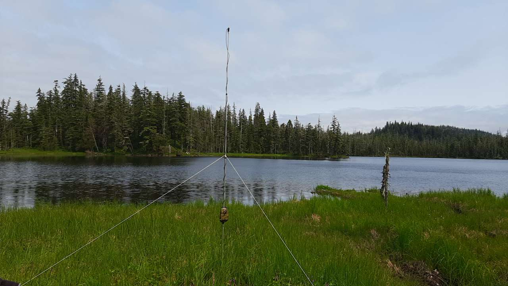
:::



# Executive Summary

The North American Bat Monitoring (NABat) program is a multi-agency initiative administered by the US Geological Survey (USGS). In 2024, the North by Northwest (NNW) Bat Hub was formed by combining the former Alberta Hub and the BC and Southeast Alaska (BC-SE_AK) Hub. The NNW Bat Hub leads the NABat program within S.E Alaska, with key support from state representatives. In 2024, 9 grid cells were monitored and in 2025 6 grid cells were monitored in Southeast Alaska. We used activity, abundance and dynamic occupancy models to evaluate the trends in bat population in the region using 7 years of acoustic data. Results indicate that bat populations across Southeast Alaska remain stable, with some key species showing small positive trends, including Little Brown Myotis and Silver-haired bat. Given growing threats to bat populations across the region, continued monitoring is essential to detect any significant changes.



# Introduction

## Overview of NABat and the NNW Bat Hub

North American Bat Monitoring Program (NABat) is a large-scale coordinated effort to monitor bat species to address gaps in knowledge and lack of long-term studies across North America [@loeb2015]. NABat uses a spatially-balanced random sampling design and standardized protocols for conducting short-term acoustic surveys and colony counts [@loeb2015]. The continental program is administered by the US Geological Survey (USGS). The Alaska Department of Fish and Game, with assistance from the US Forest Service, initiated an NABat monitoring program in Southeast Alaska in 2019.

NABat relies on regional hubs to help coordinate and standardize monitoring across smaller areas. Regional hubs help facilitate local implementation of NABat and maximize the benefits of the program within each region. The North of Northwest (NNW) Bat Hub was established in 2024 with collaboration from the governments of Alaska, Alberta, and British Columbia. The hub was formed by combining two previous regional hubs: the Alberta Hub and the BC and Southeast Alaska Hub. The NNW Bat Hub is directed by a steering committee consisting of representatives from each jurisdiction, major stakeholders, and USGS team members and it is coordinated by Biodiversity Pathways. The NNW Hub is responsible for compiling data, identifying calls to species, conducting statistical analyses, and generating annual regional reports. NABat monitoring in Southeast Alaska is implemented by the Alaska Department of Fish and Game and US Forest Service.

## Threats to bat populations in S.E. Alaska

North American bat populations are currently facing multiple anthropogenic threats, including logging and other forms of habitat loss and fragmentation, disease, pesticides, wind energy development, and climate change. The most widespread and deadly threat is white-nose syndrome (WNS), a fungal disease that attacks hibernating bats. Although WNS is not yet present in Alaska, it has spread as far west as the Rocky Mountains and as far north as the Northwest Territories in Canada ([@fig-WNS]). Following its discovery in King County in 2016, WNS has spread throughout most of Washington state and into Oregon ([@fig-WNS]) and the fungus (though not the disease) has been detected along the Washington border in southern British Columbia [@WNS].

\
The impacts of white-nose syndrome have been most severe east of the Rocky Mountains, where bats hibernate in large aggregations in caves and mines, resulting in high mortality [@cheng2021]. In the Rocky Mountains and further west, including in Alaska, Little Brown Myotis hibernate singly or in small groups in holes in the soil or between rocks in talus deposits [@neubaum2018; @blejwas2021]. This very different hibernation behavior is likely responsible for the slower rate of spread of WNS observed in Washington state [@blejwas2023]. Smaller and more dispersed winter colonies may reduce mortality relative to eastern North America, but will also make it difficult to detect the arrival and spread of WNS in Alaska and track its impact on bats in the state [@blejwas2023]. Given the absence of large hibernacula where bats may be counted and swabbed for the presence of WNS, alternative methods for monitoring bats in Southeast Alaska are required to assess changes or impacts from WNS or other threats.

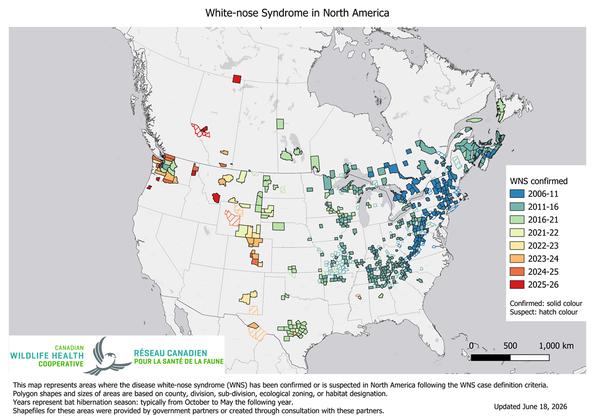{#fig-WNS}



## Acoustic Monitoring of Bats

Acoustic recordings are a cost-effective method for monitoring bat populations across large geographic and temporal scales. However, several limitations affect the conclusions that can be drawn from these data and trend estimates cannot be produced for all species using acoustic methods alone:

1.  **Imperfect species identification** --- Each bat species can produce a broad range of echolocation calls, corresponding to different behaviours in response to environmental features. Species with similar ecology and physiology often produce overlapping calls, particularly in areas with high clutter (obstacles), such as forested habitats. Although detectors are deployed to maximize recordings of diagnostic (typically Search Phase calls), species identifiability will always vary depending on the local species assemblage.

2.  **Variable detectability** --- Bat species are not equally detectable acoustically. Larger, wide-ranging species produce louder calls that travel farther, whereas species with quieter calls or specialized habitat use may be less reliably recorded.

3.  **Data variability** --- Many factors influence recording quality and bat activity, including weather, prey abundance and distribution, and local habitat. Additionally, stationary detectors may record an individual bat multiple times, meaning stationary acoustic data can only inform relative activity and occupancy.

4.  **Processing limitations** --- Auto-ID software enables efficient processing of large datasets, but is known to have high misclassification rates for bats. Manual verification generally produces more accurate results, but has its own limitations, including significantly higher processing time and cost. We use a combination of both approaches, as detailed in the [Manual Verification] subsection of the Methods.

## Statistical Models

Bat monitoring data can be analyzed using different statistical approaches, each with distinct assumptions and outputs. Activity trend models examine changes in relative acoustic activity over time, providing a straightforward measure of whether bat detections are increasing, decreasing, or remaining stable across the monitoring network.

Dynamic occupancy models take a different approach, estimating the probability that a species occupies a given site, while explicitly accounting for imperfect detection. Rather than treating a non-detection as an absence, these models distinguish between a species being truly absent versus simply going undetected, an important consideration given the variable detectability of bats discussed above. They also track colonization and extinction probabilities across sites over time, providing insight into range shifts and local population dynamics.

In 2025, both model types were run to examine differences in results and assess the complementary information each approach provides.

# Methods

## Data Collection

### Stationary Surveys

Two to four stationary detectors were deployed across at least two quadrants per grid cell for a minimum of seven nights. Sites were selected to maximize species detection and recording quality across different habitat types (see @raeBlejwas2026Alaska for details). Deployment occurred between mid-May and mid-July, after bats have emerged from hibernation but before young bats are volant. Sites and timing were kept consistent between years to minimize variability in conditions affecting bat activity.

### Transect Surveys

Where possible, driving transects were conducted following @loeb2015. Bats were recorded along the road by driving at \~20 mph with a microphone mounted vertically inside a magnetic pvc pipe holder on the vehicle's roof. Transects were 18-27 miles long and were surveyed twice during the stationary deployment period whenever possible.

### Landscape and Weather Covariates

We considered the same covariates for the activity trend models as those previously established by @raeBlejwas2026Alaska. Temperature and relative humidity were recorded in each grid cell using onsite logging devices where possible; where loggers were unavailable, values were drawn from the nearest climate station. For sites in Southeast Alaska, station records were obtained using the Meteostat package in Python [@meteostat], which aggregates weather station records from multiple agencies.

For sites in British Columbia, station records were obtained from the Pacific Climate Impacts Consortium (PCIC) Provincial Climate Data Set (PCDS), which aggregates and quality-controls observations from multiple provincial and federal networks. Additional weather covariates drawn from these station records included nightly mean wind speed (km/h) and nightly precipitation. Degree days above 10°C since January 1 were calculated from daily temperature records for each site-night.

Site-level covariates were derived from GIS (elevation, distance to water, water body type) or recorded by grid leaders during deployment (distance to clutter, percent clutter); estimates of percent clutter were confirmed using site photos. For sites with smaller ponds that did not appear on the GIS, we used the distance estimate recorded by the grid leader.

We explored additional factors influencing colonization and extinction in the dynamic occupancy models. For those models we included distance to the nearest road, and distance to timber harvest, calculated as the distance from each survey location to the closest road or harvest feature. Road and harvest features for British Columbia were derived from the unpublished Human Footprint Index (HFI) layer currently being developed by the Geospatial Centre within Biodiversity Pathways. Road features for Southeast Alaska were taken from the Alaska Department of Transportation and Public Facilities ([AKDOT](Model%20covariates%20for%20the%20activity%20trend%20models%20and%20dynamic%20occupancy%20models%20were%20based%20on%20those%20established%20by%20@rae2024,%20with%20additional%20exploration%20of%20factors%20influencing%20colonization%20and%20extinction%20in%20the%20dynamic%20occupancy%20models.%20For%20the%20dynamic%20occupancy%20models%20we%20included%20distance%20to%20the%20nearest%20road,%20calculated%20as%20the%20distance%20from%20each%20survey%20location%20to%20the%20closest%20road%20feature.%20Road%20features%20for%20British%20Columbia%20were%20derived%20from%20the%20unpublished%20Human%20Footprint%20Index%20(HFI)%20layer%20currently%20being%20developed%20by%20the%20Geospatial%20Centre%20within%20Biodiversity%20Pathways,%20while%20those%20for%20Southeast%20Alaska%20were%20taken%20from%20the%20Alaska%20Department%20of%20Transportation%20and%20Public%20Facilities%20(AKDOT)%20Roads%20layer,%20a%20statewide%20road-centerline%20dataset%20distributed%20through%20the%20State%20of%20Alaska%20open-data%20portal%20(https://gis.data.alaska.gov/datasets/AKDOT::roads-akdot/about).)) Roads layer and the US Forest Service Transportation layer. Harvest features for Southeast Alaska were taken from the US Forest Service Tongass_National_Forest_Past_Harvest_from_CoverType layer.

### Manual Verification

In 2024 and 2025 acoustic analysis mostly followed the standards set by WCSC in previous years [@raeBlejwas2026Alaska]. This included running all files through two automatic classifiers, Kaleidoscope's Bats of North America 5.4.0 classifier and Sonobat 3.0's southeast Alaska classifier, to remove files that do not contain bat pulses and giving a preliminary bat species identification.

Manual vetting largely follows the protocol of @reichert2018 and previous analysis standards developed by WCSC [@raeBlejwas2026Alaska]. The key difference in the 2024 and 2025 acoustic analysis compared to previous years is that not all automatic species identifications were manually verified. Instead, based on findings from @stratton2022 , at least 50% of recordings were selected for manual verification.

#### *Subsetting for manual verification*

Given the project's large scale, manually vetting all recordings is not feasible long-term. To address this, the NNW Bat Hub, in collaboration with WCSC and Brian Paterson, developed procedures to ensure that selecting a subset of recordings for manual review minimizes biases in analytical results. These standards prioritize the accurate identification of rare and difficult-to-recognize species to maintain the integrity of models and analyses.

To ensure data accuracy, manual verification was conducted based on the number of recordings that received an autoID tag at each site. For sites with 200 or fewer tagged recordings, all non-noise recordings were manually reviewed. For sites with more than 200 tagged recordings, verification depended on the proportion of recordings assigned a species label. All tags for rare species (comprising ≤10% of prior years' identifications) and commonly misidentified species were fully vetted. Specifically, all Hoary Bat (*Lasiurus cinereus*) and Silver-haired Bat (*Lasyonicteris noctivagans*) were reviewed due to the frequent misclassification of noise files that are tagged as these species. Additionally, recordings of common species were randomly selected for verification until 50% of total recordings were reviewed. If fewer than 50% of recordings had species tags, all classifier-assigned tags were manually verified, and "NoID" recordings were randomly selected until 50% of all recordings were reviewed.

Manual verification is complicated by the lack of information on species ranges within Southeast Alaska. We considered all species found in the region as potential candidates in all grid cells with the exception of Long-legged and Yuma Myotis. Long-legged Myotis calls are acoustically similar to those produced by the much more common Little Brown Myotis and auto ID software frequently misclassifies the calls of these two species. Unfortunately, although Little Brown Myotis produces diagnostic calls, Long-legged Myotis does not. Therefore, in grid cells without independent confirmation of the presence of Long-legged Myotis, we downgraded all auto IDs of that species to a Little Brown Myotis/Long-legged Myotis couplet. Where that species has been confirmed present, we retained the species identification unless diagnostic characteristics of Little Brown Myotis were present. Calls of California Myotis also lack diagnostic characteristics and are acoustically similar to Yuma Myotis. However, to date Yuma Myotis has been documented only in the southern portion of Southeast Alaska [@olson2014First]and prior to 2024 we chose to exclude it as a potential species except for the Ketchikan and Prince of Wales grids. Beginning in 2024, we started including it in the species set for all grids in order to be able to detect any expansion of its range within Southeast Alaska.

## Statistical Analyses

### Activity Trends

We conducted species-specific trend analyses using negative binomial GLMM models as described in @raeBlejwas2026Alaska. We restricted the analysis to data from 2019 onward, due to the low number of grid cells that had been sampled in the years prior (2015 and 2017). We further limited the analysis to grid cells with at least five years of sampling, since estimating a temporal trend requires enough repeat visits per cell to distinguish a directional signal from year-to-year variation.

All models followed the same basic structure, modelling the total number of detected calls as a negative binomial response with log link:

``` r
Total detections ~ YearS + log(Sample Nights) + (1|Grid Cell ID) + (1|Quadrant) 
+ species specific covariates
```

Where total detections is the total number of detected calls of a given species at a site in a given year. YearS is the standardized survey year (years since 2019) and provides the estimate of the temporal activity trend. log(Sample Nights) is the natural logarithm of the number of detector-nights and accounts for variation in sampling effort among site-years. The random intercepts (1\|Grid Cell ID) and (1\|Quadrant) allow baseline activity to vary among grid cells and among quadrants within them, respectively.

For each species, we performed model selection by fitting the base model augmented with every combination of up to four covariates, excluding combinations that would introduce collinearity. This produced 387 candidate models per species, from which we selected the model with the lowest AIC as the final covariate set [@tbl-cov].

```{r}
#| echo: false
#| warning: false
#| message: false
#| include: true
#| label: tbl-cov
#| tbl-cap: Top-performing stationary models selected via AIC-based stepwise selection. Covariates are described as, Distance to Clutter = distance (m) to nearest object; Percent Clutter = estimated percentage of space within a 30m radius obstructed by objects; Water Nearby = detector within 100m of water; WaterDist = distance (m) to nearest water feature; Nightly Temperature = nightly air temperature (°C); RH = nightly relative humidity (%); Nightly Mean Wind Speed = mean nightly wind speed (m/s); Nightly Precipitation = total nightly precipitation (mm); jNight = Julian date (day of year) of the survey night.
#| fig.pos: 'H'

kable(model_covariates,
      col.names = c("Species", "Top Performing Model Covariates"),
      label = "model-covariates") %>%
  kable_styling(bootstrap_options = c("striped", "hover", "condensed"),
                full_width = FALSE,
                position = "left") %>%
  column_spec(1, width = "15em") %>%
  column_spec(2, width = "25em")

```

Post-hoc tests were run on the final models to ensure proper model fit. Species were excluded from the analysis if model fit was not appropriate due to issues including under-dispersion or standard errors that were more than 3 times the estimate. Model results were also excluded if there was less than 150 recordings across all sample years.

#### Use of Automated Identification Results in Stationary Trend Analyses

For stationary trend analyses, species identifications came from the Kaelidoscope Pro AutoID software, not from manual verification. Manual review was used only to remove non-bat noise. Specifically, files that manual review flagged as noise were excluded, but where manual review suggested a different species than the AutoID label, the AutoID classification was retained.

This approach was first identified as necessary in 2023 [@rae2024], when analyses of manually verified data revealed a consistent positive trend across all species, this was interpreted as an artifact of reviewer learning over time rather than a true biological signal. As verifier experience increased across years, calls were increasingly assigned to specific species rather than left unidentified, producing an apparent increase in detections independent of actual bat activity. Because this observer effect is difficult to control for statistically, AutoID classifications are now used as the standard for all activity trend analyses, as automated classifiers apply consistent criteria across all years. While AutoID is subject to some misclassification, the error rate is consistent across years and does not confound detection of genuine temporal trends.

Trend analyses are presented only for species confirmed present through manual verification and for which models fully converged.

### Transect Abundance Models

For the transect-based abundance trend models, we used only manually verified detections. When a detection was flagged as a species couplet, it was counted toward each species in the couplet. As above, we restricted the data to transect surveys from 2019 onward and to grid cells with at least five years of sampling.

All models followed the same basic structure, modelling the total number of detected calls as a negative binomial response with log link:

``` r
Total detections ~ YearS + log(transect length) + (1|Grid Cell ID) 
+ species specific covariates
```

Where total detections is the total number of detected calls of a given species at a site in a given year. YearS is the standardized survey year (years since 2019) and provides the estimate of the temporal activity trend. log(transect length) is the natural logarithm of the total length of the transect sampled and accounts for variation in sampling effort among transects. The random intercept (1\|Grid Cell ID) allow baseline activity to vary among grid cells.

Covariates were limited to weather variables and transect length, and candidate models excluded any combination of collinear variables. We fit 59 candidate models per species and selected the one with the lowest AIC as the final covariate set [@tbl-cov-transects].

```{r}
#| echo: false
#| warning: false
#| message: false
#| include: true
#| label: tbl-cov-transects
#| tbl-cap: Top-performing transect models selected via AIC-based stepwise selection.Covariates are described as,Nightly Precipitation = total nightly precipitation (mm); jNight = Julian date (day of year) of the survey night.
#| fig.pos: 'H'

kable(transect_covariates,
      col.names = c("Species", "Top Performing Model Covariates"),
      label = "model-covariates") %>%
  kable_styling(bootstrap_options = c("striped", "hover", "condensed"),
                full_width = FALSE,
                position = "left") %>%
  column_spec(1, width = "15em") %>%
  column_spec(2, width = "25em")
```

After selection, we ran a series of post-hoc checks to confirm model fit. We treated a species' result as reliable only when these tests agreed that the year effect reflected a genuine regional trend rather than an artefact of sparse counts or a single influential cell.

### Dynamic Occupancy

We fitted multi-season (dynamic) occupancy models [@mackenzie2003] to estimate trends in occupancy, colonization, and persistence while accounting for imperfect detection. This analysis used nightly acoustic detection/non-detection data from passive bat detectors deployed at 43 stationary detector sites located in 9 grid cells in Southeast Alaska, as well as 173 stationary detector sites in 56 grid cells in British Columbia (BC). Pooling the two regions allowed the more extensive BC data to inform species-specific detection probabilities and covariate slopes, improving our ability to distinguish true absences from non-detections and thereby sharpening occupancy estimates where Alaska data were sparse. A region effect accounted for structural differences in the landscape between British Columbia and southeast Alaska, allowing us to characterize occupancy trends for southeast Alaska with greater precision than an Alaska-only model would permit.

Data were filtered to the 2017--2025 period, and analysis used an every-other-night subsampling protocol to reduce temporal autocorrelation between consecutive nights, using a maximum of 4 nights per site-year. Sites had to have a minimum of 2 nights of data within a given year and data from at least 2 years total. Models were run separately for all 7 bat species.

Initial occupancy ($\psi$) was modeled as a function of elevation and water nearby, with a random effect for region. Baseline occupancy for the Alaska region was estimated from Alaska detections only and was not forced toward the BC average. Colonization ($\gamma$) and persistence ($\varphi$) were modeled with time-varying intercepts and distance to road as a covariate. Detection probability (p) was modeled as a function of percent clutter, nightly mean temperature, and Julian night.

All continuous covariates were standardized by centering on their mean and dividing by their standard deviation; missing covariate values were imputed with the global mean prior to standardization.

Models were fit in a Bayesian framework using JAGS (Version 4.3.2) via the `jagsUI` package (Version 1.6.3) in r (Version 4.5.1). We ran 3 chains in parallel for 30,000 iterations each, discarding the first 15,000 as burn-in and thinning the remainder by 5, yielding 9,000 posterior samples for inference. Priors on all regression coefficients were normal with mean 0 and precision 0.368 (equivalent to a standard deviation of approximately 1.65), and the standard deviation of the region-level random effect was assigned a Uniform(0, 5) prior. Convergence was assessed using Rhat diagnostics, with values below 1.1 taken to indicate convergence. Results are summarized using posterior means and 95% Bayesian credible intervals. We calculated an overall occupancy trend metric (𝜆) as the ratio of estimated occupancy in the final year to that in the initial year; values of 𝜆 \> 1 with 95% credible intervals entirely above 1 indicate an increase in occupancy, values 𝜆\<1 with intervals entirely below 1 indicate a decline, and intervals overlapping 1 indicate an uncertain or stable.

# Results

In 2024 all 9 grid cells were monitored, and in 2025 a total of 6 grid sites were sampled in SE Alaska and 3 newly established sites were sampled in the Anchorage area (@fig-sites).

```{r}
#| label: fig-sites
#| echo: false
#| warning: false
#| message: false
#| out-width: 100%
#| fig-pos: H
#| fig-cap: !expr cap_sitesummary

if (is_html) {
  # Interactive Leaflet widget for the HTML output
  m
} else {
  # LaTeX/PDF cannot embed an interactive widget, so capture a static
  # screenshot of the map with mapshot2() and insert the PNG instead.
  if (!dir.exists("Figures")) dir.create("Figures")
  map_png <- "Figures/site_summary_map.png"
  
  m_static <- leaflet(map_data) %>%
    addProviderTiles(providers$CartoDB.Positron) %>%
    addPolygons(
      data        = grids,
      color       = ~border_col,
      weight      = 4,
      opacity     = 1,
      fill        = FALSE,
      group       = "GRTS grid cells")%>%
    fitBounds(
      min(map_data$Long, na.rm = TRUE), min(map_data$Lat, na.rm = TRUE),
      max(map_data$Long, na.rm = TRUE), max(map_data$Lat, na.rm = TRUE)
    ) %>%
    addLegend(
      position = "bottomleft",
      colors   = c("#e31a1c", "#ff7f00", "#999999"),
      labels   = c("Last sampled 2025", "Last sampled 2024", "Previous years"),
      title    = "GRTS cell status",
      opacity  = 1
    )
  
  mapview::mapshot2(
    m_static,
    file    = map_png,
    vwidth  = 900,   # render width in px  (controls aspect ratio)
    vheight = 650,   # render height in px
    delay   = 1.5    # give the basemap tiles time to load before capture
  )
  
  knitr::include_graphics(map_png)
}
```

Total acoustic activity varied substantially across sites and years, with Little Brown Myotis dominating call volume at every site in nearly every year. Overall detection totals were highest at the northern sites: Yakutat produced the single largest site-year total (\~17,500 calls in 2024), and Juneau recorded consistently high volumes (\~12,000 in 2020 and \~13,500 in 2024). Southern and central sites generally recorded lower totals, with Petersburg (\~9,000 in 2024) and POW (\~7,500 in 2024) reaching comparable peaks in single years, while Wrangell and Hoonah remained low throughout (generally under \~2,000 calls per year). Most sites recorded substantially higher activity in 2024 than in any other year.

```{r}
#| label: fig-activitysummary 
#| echo: false
#| warning: false
#| message: false 
#| out-width: 100% 
#| fig-pos: H
#| fig-width: 13
#| fig-height: 6
#| fig-cap: Relative activity of bat species detected during NABat monitoring in 9 grid cells in Southeast Alaska, arranged north to south, during 2019-2025  
 
actsum
```

## Activity and Abundance Trends

We estimated yearly trends in nightly acoustic activity for seven species across the stationary detector and mobile transect survey streams. Five species produced reportable stationary-detector models; two (Long-legged Myotis, Yuma Myotis) could not be reliably fit and are not reported [@tbl-models]. For transect abundance trends we only report on the results of Silver-haired bat and Little Brown bat since these were the only two species were modelling results were reliable.

Silver-haired Bat showed the clearest and most consistent signal, with activity increasing significantly over the monitoring period in both the stationary (β = 0.48 ± 0.17, p \< 0.001) and transect (β = 0.40 ± 0.20, p = 0.001) datasets, the only species for which a significant trend was recovered independently in both survey types.

California Myotis showed an increase in activity from the stationary model (β = 0.14 ± 0.13, p = 0.036). Long-eared Myotis (β = 0.06 ± 0.13, p = 0.35) and Little Brown Myotis (stationary β = 0.08 ± 0.14, p = 0.24; transect β = 0.00 ± 0.12, p = 0.94) showed no detectable trend, with confidence intervals spanning zero in both reportable models.

Hoary Bat, Long-legged Myotis and Yuma Myotis are not reported: Hoary bat and Long-legged Myotis fell below the detection threshold required for trend estimation, and the Yuma Myotis model failed to converge.

```{r}
#| echo: false
#| warning: false
#| message: false
#| label: tbl-models
#| tbl-cap: Trend estimates from NABat stationary and transect monitoring in southeast Alaska, 2019–2025, adjusted for covariates. Estimates are on the natural-log scale. Stationary and transect models were fit separately as independent pipelines; blank cells indicate species that did not meet the criteria for reporting in that framework. Significant results (p < 0.05) are shown in bold.
#| tbl-pos: 'H'

# Display table with conditional bolding for both stationary and transect
kable(merged_table %>% select(Species, stationary_trend, stationary_p, transect_trend, transect_p),
      col.names = c("Species", "Trend Estimate ± 95%CI", "P-value",
                    "Trend Estimate ± 95%CI", "P-value"),
      align = c("l", "r", "r", "r", "r"),
      booktabs = TRUE) %>%
  kable_styling(latex_table_env = "tabular") %>%
  add_header_above(c(" " = 1, "Stationary Models" = 2, "Transect Models" = 2)) %>%
  column_spec(2, bold = ifelse(!is.na(merged_table$stationary_pval) & merged_table$stationary_pval < 0.05, TRUE, FALSE)) %>%
  column_spec(3, bold = ifelse(!is.na(merged_table$stationary_pval) & merged_table$stationary_pval < 0.05, TRUE, FALSE)) %>%
  column_spec(4, bold = ifelse(!is.na(merged_table$transect_pval) & merged_table$transect_pval < 0.05, TRUE, FALSE)) %>%
  column_spec(5, bold = ifelse(!is.na(merged_table$transect_pval) & merged_table$transect_pval < 0.05, TRUE, FALSE))
```

### Covariate Effects

Beyond the year term used to estimate activity trends, each species' best-supported model retained one or more weather or temporal covariates, and stationary models could additionally retain site-level descriptors ([@tbl-cov-models]). Because transect surveys traverse heterogeneous terrain within a cell, site-specific covariates such as distance to clutter, percent clutter, and distance to water were eligible only in the stationary models.

Covariates describing moisture in the air were among the most frequently retained across species, entering models either as relative humidity or as nightly precipitation. Retained weather terms were consistently negative in sign, indicating lower nightly activity under wetter conditions, a pattern consistent with reduced foraging during precipitation and elevated humidity.

```{r}
#| echo: false
#| warning: false
#| message: false
#| label: tbl-cov-models
#| tbl-cap: Covariate effects from the best-fitting (lowest-AIC) negative binomial generalized linear mixed model for each species' stationary and transect acoustic detector data. Estimates are fixed-effect coefficients on the log link (± 1.96 × standard error, an approximate 95% confidence interval). Only species with a reportable stationary trend model are included.
#| tbl-pos: 'H'

cov_kbl

```

## Dynamic Occupancy

Dynamic occupancy models converged for all species. Due to the low number of Hoary bat detections across the monitoring period all Hoary bat results were removed from this report. Four species showed increasing occupancy over the 2017–2025 period, comprising all Myotis species except California Myotis: Long-legged Myotis (λ = 1.43, 95% CI 1.18–1.77), Long-eared Myotis (λ = 1.25, 1.05–1.50), Little Brown Myotis (λ = 1.10, 1.03–1.19), and Yuma Myotis (λ = 1.44, 1.17–1.79) ([@tbl-occ-trends]).

For the remaining three species, Silver-haired Bat (λ = 1.05, 0.95–1.17), and California Myotis (λ = 1.16, 1.00–1.35) ([@tbl-occ-trends]), the 95% credible interval for λ overlapped 1, indicating that no directional change in occupancy could be detected.

```{r}
#| label: tbl-occ-trends
#| echo: false
#| warning: false
#| message: false
#| tbl-pos: H
#| tbl-cap: Occupancy trend estimates. Trend slopes from dynamic occupancy models and lambda, with 95% confidence intervals in parentheses. Bolded rows mark estimates where the λ interval excluded 1, suggesting a changing trend; unbolded rows indicate no detectable trend.

kable(trend_tbl,
      col.names = c("Species", "Trend Slope (95% CI)", " λ (95% CI)"),
      row.names = FALSE) %>%
  kable_styling(bootstrap_options = c("striped", "hover"),
                full_width = FALSE,
                position = "left") %>%
  row_spec((nrow(trend_tbl) - 3):nrow(trend_tbl), bold = TRUE)
```

### Covariate Effects

Covariate effects varied by species, but temperature was the most consistent detection covariate, with warmer nights associated with higher detection probability for most species. Clutter effects on detection probability were present but species-specific, and Julian date effects were mixed across species ([@tbl-occ-covariates]).

```{r}
#| label: tbl-occ-covariates
#| echo: false
#| warning: false
#| message: false
#| tbl-pos: H
#| tbl-cap: Covariate effects on occupancy dynamics and detection for each species. Values are estimated coefficients with 95% confidence intervals in parentheses. Covariates are grouped by the model parameter they act on: initial occupancy, colonization, persistence, and detection. Dashes (—) indicate covariates that were not retained in the selected model for that species. No covariates are presented for Hoary bat due to low number of detections over the sample years.
 
occ_kable$LACI <- NULL

occ_kable <- kable(occ_tbl,
                   format = "html",                       # force HTML so styling applies even in PDF render
                   col.names = c("Covariate", species_cols),
                   row.names = FALSE,
                   label = "occ-covariates") %>%
  kable_styling(bootstrap_options = c("striped", "hover", "condensed"),
                full_width = FALSE,
                position = "left") %>%
  column_spec(1, width = "10em") %>%
  column_spec(2, width = "6em",
              extra_css = "min-width: 6em; white-space: nowrap;") %>%
  column_spec(3:(length(species_cols) + 1),
              width = "20em") %>%
  pack_rows(index = index_vec, bold = TRUE, italic = FALSE,
            label_row_css = "text-align: left; border-bottom: 1px solid #ddd;")

if (is_pdf) {
  dir.create("figures", showWarnings = FALSE)
  save_kable(occ_kable, file = "figures/occ_covariates.png", zoom = 2)
  knitr::include_graphics("figures/occ_covariates.png")
} else {
  occ_kable
}
```

More detailed species results can be found on [Appendix A](#sec-appendix-a).

# Discussion

Overall, Alaska bat populations do not show evidence of decline, and several species show potential increases: the Silver-haired Bat (LANO) in activity, and most Myotis species in occupancy.

The positive activity trends for the California Myotis (MYCA) and LANO should be interpreted with caution [@tbl-models]. Activity counts are noisy, and it can be difficult to distinguish a true trend from a spurious increase driven by year effects. For this reason it is prudent to examine trends across many years; a trend that persists across years is more likely to reflect a real change. The 2023 Alaska report [@raeBlejwas2026Alaska] identified a negative and non-significant trend for MYCA, so although the estimate is significant in the present analysis, additional years of data are needed to confirm it.

In contrast, @raeBlejwas2026Alaska found a positive activity trend for LANO that was marginally non-significant (p = 0.05), and the continued positive trend observed in this report (stationary: 0.48 ± 0.17 p\<0.001, and transect 0.40 ± 0.20 p\<0.001) suggests it may represent a genuine trend rather than noise. Two additional results point the same way. The occupancy results from this report show that although the occupancy trend is not significant, it is positive [@tbl-occ-trends]. The second independent study by @bradleyjudell has preliminary NABat species-distribution and trend models estimate an increase in LANO occupancy across Alaska (mean = 0.23, 95% CI \[0.07, 0.39\]). The accumulation of estimates pointing consistently in the same direction, across different datasets and modeling approaches, gives us a solid point from which to conlcude LANO is increasing in occupancy across southeast Alaska. This pattern also speaks to why we include occupancy analyses alongside activity trends in this report: activity counts are noisy and easily perturbed by year effects, so a metric that is less sensitive to fluctuations in activity volume offers a valuable complementary check.

Occupancy models require a stronger signal to detect change, because they consider only whether a cell is occupied rather than overall activity levels. As a result, when a trend is detected in occupancy we can be more confident that it reflects a real change. Our occupancy results indicate that all Myotis species except MYCA may be increasing in occupancy [@tbl-occ-trends; [Appendix A](#sec-appendix-a)], which could suggest that Myotis species are expanding in Southeast Alaska. It is worth noting that MYCA is the one Myotis species that does not show an increase in occupancy, in direct contrast to its positive activity trend. This divergence reinforces the caution above: the MYCA activity estimate should not be treated as confirmed until additional years of data are available. With that caveat in mind, the broader occupancy signal is encouraging, particularly because these are the species most likely to be affected by white-nose syndrome (WNS).

One important consideration is the large pulse in activity observed across most sites in 2024. Sampling effort in 2024 was comparable to previous years and to 2025, so this spike most likely reflects year-to-year variation in bat activity rather than a change in survey design. This pulse currently registers as part of the trend in the models because of its magnitude, but additional years of data will help discern whether it represents a true trend or a short-lived effect of an atypical year.

## Looking forward

The reduced survey effort in 2025 was the result of staffing cuts at the US Forest Service, and staffing levels are unlikely to improve in the near future. Maintaining sampling at the sites and grid cells with the most continuous data is vital to ensuring that we can continue to detect population changes, especially given the imminent threat of WNS. If the number of grids must be reduced, priority should be given to retaining those that have been sampled the longest.

Collaboration with other agencies could also help sustain monitoring at existing or new sites. One approach currently being explored in British Columbia and Alberta is engaging industry partners, such as those in the forestry and wind energy sectors, in coordinated monitoring at their sites, and having them contribute both to the hub and to the broader effort. Such partnerships may be easier to establish where regulatory frameworks support them, for example by requiring that monitoring data collected at industry sites be submitted to NABat.

Another way to sustain monitoring is to look for ways to make the process more efficient. Grid leaders should continue to be encouraged to use Survey123 to streamline site deployment; in 2024 and 2025 this platform was not used consistently across all grids. Using it also helps ensure that metadata are consistent and complete. In 2026 we can also examine efficiencies in weather data collection, specifically evaluating whether continued use of on-site temperature and humidity loggers yields results comparable to weather data drawn from the nearest weather stations.

As species ranges continue to expand, a review of the data aimed at identifying potential new species would be prudent, particularly the Big Brown Bat (EPFU). Because this species produces calls very similar to those of LANO, bioacoustics could be used for preliminary screening to find potential sites worth exploring further. Once these sites are identified, capture surveys can be conducted, as capturing bats will ultimately be the only way to confirm a range expansion.

# Appendix A {#sec-appendix-a}

## Silver-haired Bat (*Lasyonicteris noctivagans*)

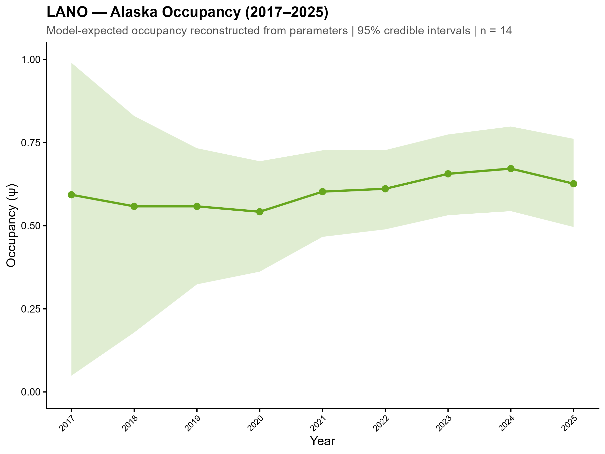 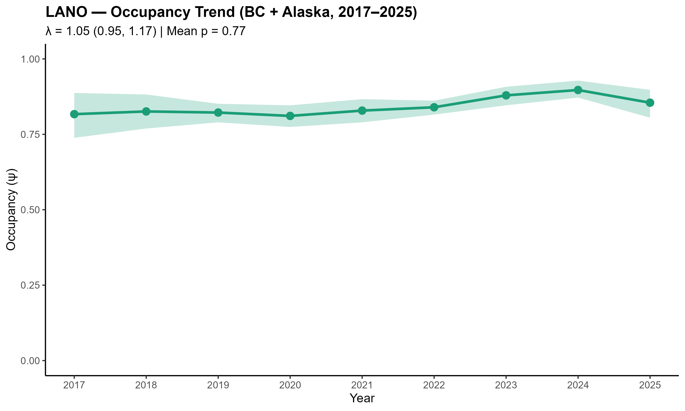 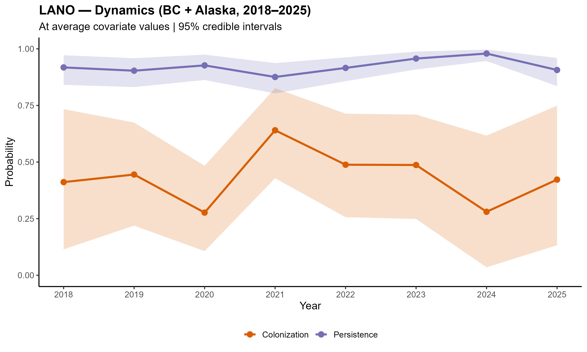 

## California Myotis (*Myotis californicus*)

 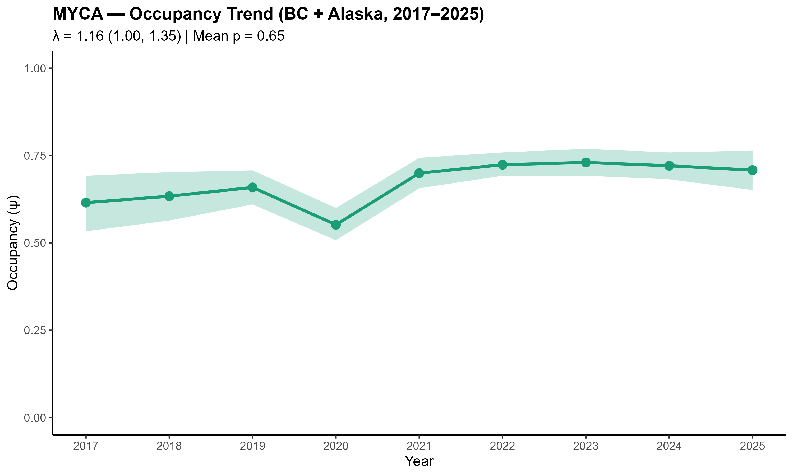  

## Long-eared Myotis (*Myotis evotis*)

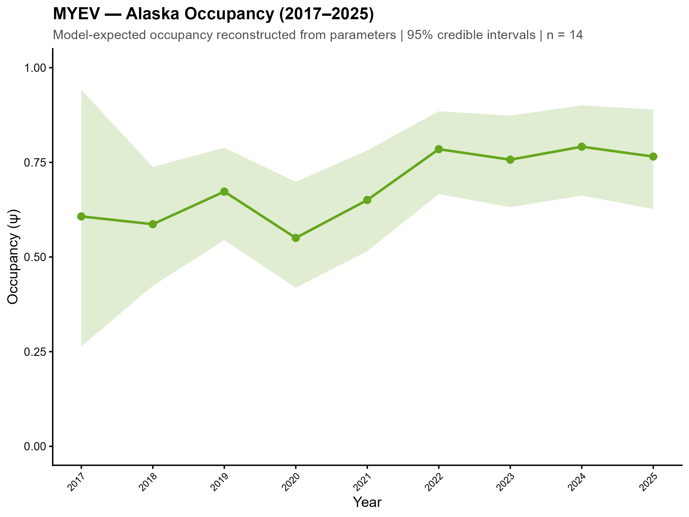  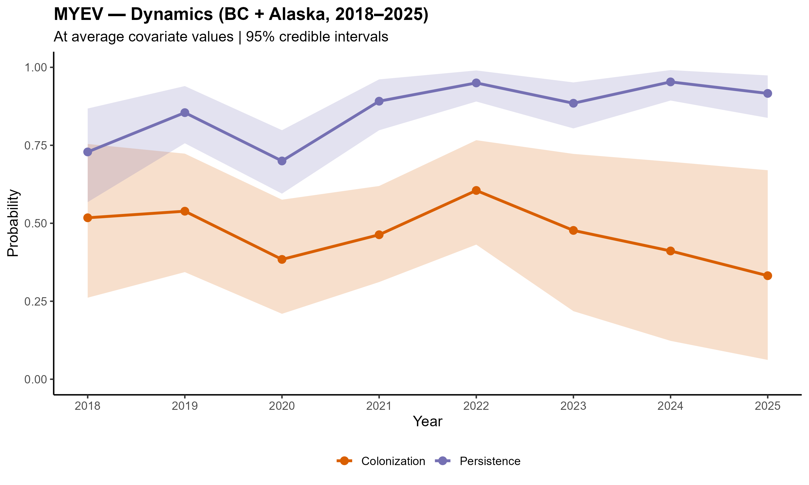 

## Little Brown Myotis (*Myotis lucifugus*)

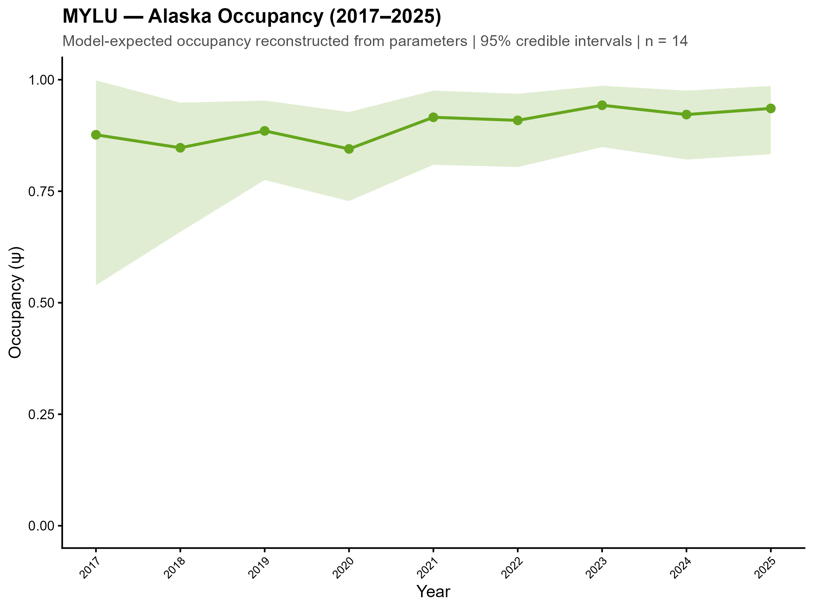  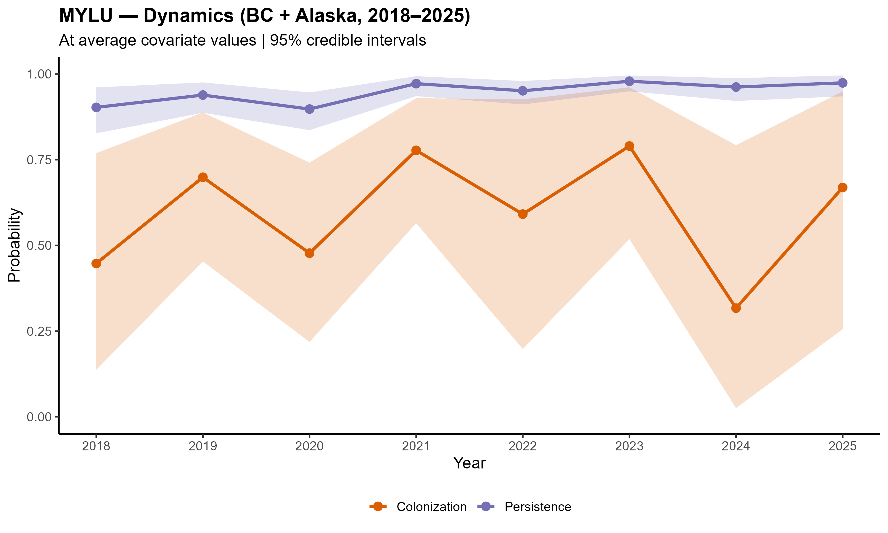 

## Long-legged Myotis (*Myotis volans*)

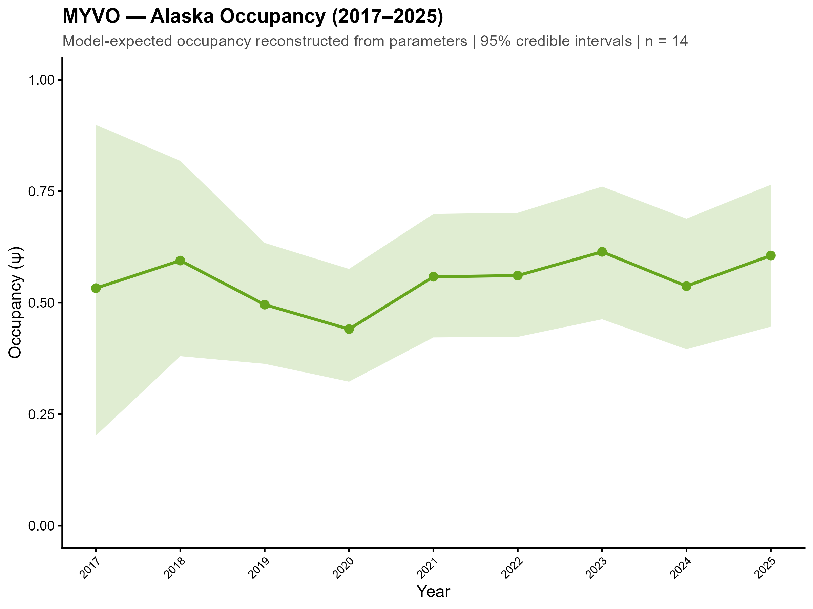   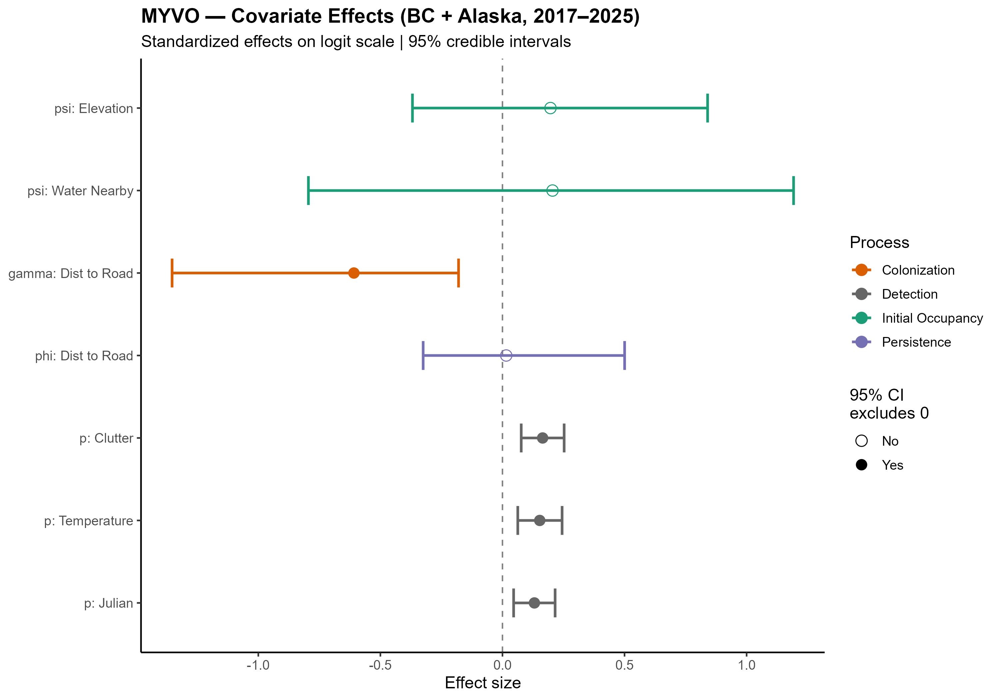



```{r}
#| label: AppendixB
#| echo: false
#| warning: false
#| message: false
#| output: asis

# ---- Appendix B: per-site popup content, PDF only ------------------------
# Recreates the pie chart + "Mean detections by date" chart from the map
# popups, screenshots each with webshot2, one site per subsection.
if (is_pdf) {
  
  appx_dir <- "Figures/AppendixB"
  if (!dir.exists(appx_dir)) dir.create(appx_dir, recursive = TRUE)
  
  # years to show, top to bottom
  appx_years <- c(2025, 2024)
  
  # shared CSS for the year subheadings
  year_css <- ".yearBlock{margin-bottom:16px;}.yearHdr{font-family:sans-serif;font-weight:bold;font-size:16px;color:#2c3e50;border-bottom:2px solid #ccc;margin:6px 0 8px;padding-bottom:2px;}"
  
  # ---- Assign each site to a GRTS cell by the polygon its point falls in ----
  pts_sf    <- sf::st_as_sf(map_data, coords = c("Long", "Lat"), crs = 4326, remove = FALSE)
  cell_join <- sf::st_join(pts_sf, grids["GRTS_ID"], left = TRUE)
  md        <- sf::st_drop_geometry(cell_join)          # map_data cols + GRTS_ID
  
  cell_lookup <- md[, c("Site_key", "GRTS_ID")]
  site_names  <- md[, c("Site_key", "Site")]
  
  # grid cell name per site (new column in Sites2025.csv)
  name_lookup <- sites %>%
    dplyr::transmute(
      Site_key     = tolower(trimws(Location.Name)),
      GridCellName = GridCellName                     # <- adjust if header differs
    ) %>%
    dplyr::distinct(Site_key, .keep_all = TRUE)
  
  md <- dplyr::left_join(md, name_lookup, by = "Site_key")
  
  # one name per GRTS cell (first non-empty among that cell's sites)
  cell_name_for <- function(cl) {
    nm <- md$GridCellName[!is.na(md$GRTS_ID) & md$GRTS_ID == cl]
    nm <- nm[!is.na(nm) & nzchar(trimws(nm))]
    if (length(nm)) trimws(nm[1]) else NA_character_
  }
  
  sd_all <- site_day %>%
    dplyr::left_join(cell_lookup, by = "Site_key") %>%
    dplyr::left_join(site_names,  by = "Site_key")
  
  pts_all <- df_pts %>%
    dplyr::select(-SiteName) %>%                            # drop raw (all-caps) name
    dplyr::left_join(cell_lookup, by = "Site_key") %>%
    dplyr::left_join(site_names,  by = "Site_key")
  
  site_palette <- c("#e41a1c", "#377eb8", "#4daf4a", "#984ea3",
                    "#ff7f00", "#a65628", "#f781bf", "#666666")
  
  cells <- sort(unique(md$GRTS_ID[!is.na(md$GRTS_ID)]))
  
  pie_html <- pie_png <- bar_html <- bar_png <- hr_html <- hr_png <- cell_tag <- cell_title <- character(0) 
  
  for (cell in cells) {
    cell_sites <- sort(unique(md$Site[!is.na(md$GRTS_ID) & md$GRTS_ID == cell]))
    if (length(cell_sites) == 0) next
    cell_keys <- tolower(trimws(cell_sites))
    cols <- setNames(site_palette[((seq_along(cell_sites) - 1) %% length(site_palette)) + 1], cell_sites)
    tag  <- gsub("[^A-Za-z0-9]+", "_", as.character(cell))
    cname    <- cell_name_for(cell)
    cell_lab <- if (!is.na(cname)) paste0(cell, " - ", cname) else as.character(cell)
    
    sd_cell  <- sd_all[!is.na(sd_all$GRTS_ID)  & sd_all$GRTS_ID  == cell, ]
    pts_cell <- pts_all[!is.na(pts_all$GRTS_ID) & pts_all$GRTS_ID == cell, ]
    
    # which years actually have data for this cell, per artifact
    pie_years <- appx_years[appx_years %in%
                              site_species_year$year[site_species_year$Site_key %in% cell_keys]]
    bar_years <- appx_years[appx_years %in% sd_cell$year]
    hr_years  <- appx_years[appx_years %in% pts_cell$year]
    if (!length(pie_years)) pie_years <- appx_years
    if (!length(bar_years)) bar_years <- appx_years
    if (!length(hr_years))  hr_years  <- appx_years
    
    # Page 1: one titled pie per site, one year block per year
    pies_inner <- paste(vapply(pie_years, function(y) {
      items <- vapply(cell_sites, function(s) {
        counts <- counts_year(tolower(trimws(s)), y)
        sprintf('<div class="pieItem"><div class="pieTitle">%s</div>%s</div>',
                htmltools::htmlEscape(s), make_pie_svg(counts))
      }, character(1))
      sprintf('<div class="yearBlock"><div class="yearHdr">%s</div>%s</div>',
              y, paste(items, collapse = ""))
    }, character(1)), collapse = "")
    
    pies_page <- sprintf('<!DOCTYPE html><html><head><meta charset="utf-8"><style>body{margin:0;padding:12px;background:#fff;}#pies{width:740px;}%s.pieItem{display:inline-block;vertical-align:top;text-align:center;margin:8px;}.pieTitle{font-family:sans-serif;font-weight:bold;font-size:14px;color:#2c3e50;margin-bottom:2px;}</style></head><body><div id="pies">%s</div></body></html>',
                         year_css, pies_inner)
    
    # Page 2: combined bar (site-coloured), one year block per year
    bar_inner <- paste(vapply(bar_years, function(y) {
      sd_cy   <- sd_cell[sd_cell$year == y, ]
      bar_svg <- make_multisite_dayseries_svg(sd_cy, cols, width = 700L, height = 360L)
      sprintf('<div class="yearBlock"><div class="yearHdr">%s</div>%s</div>', y, bar_svg)
    }, character(1)), collapse = "")
    
    bar_page <- sprintf('<!DOCTYPE html><html><head><meta charset="utf-8"><style>body{margin:0;padding:12px;background:#fff;}#bar{display:inline-block;}%s</style></head><body><div id="bar">%s</div></body></html>',
                        year_css, bar_inner)
    
    # Page 3: combined hour facets (site-coloured dots), one year block per year
    hr_inner <- paste(vapply(hr_years, function(y) {
      pts_cy <- pts_cell[pts_cell$year == y, ]
      hr_svg <- make_hourfacet_svg(pts_cy, ylim = hour_ylim, site_cols = cols,
                                   width = 700L, panel_h = 380L, panel_gap = 6L,
                                   ml = 44L, mr = 10L, strip_h = 17L, point_r = 2.6, font_size = 11L)
      sprintf('<div class="yearBlock"><div class="yearHdr">%s</div>%s</div>', y, hr_svg)
    }, character(1)), collapse = "")
    
    hr_page <- sprintf('<!DOCTYPE html><html><head><meta charset="utf-8"><style>body{margin:0;padding:12px;background:#fff;}#hr{display:inline-block;}%s</style></head><body><div id="hr">%s</div></body></html>',
                       year_css, hr_inner)
    
    ph <- normalizePath(file.path(appx_dir, paste0(tag, "_pies.html")), mustWork = FALSE)
    bh <- normalizePath(file.path(appx_dir, paste0(tag, "_bar.html")),  mustWork = FALSE)
    hh <- normalizePath(file.path(appx_dir, paste0(tag, "_hour.html")), mustWork = FALSE)
    writeLines(pies_page, ph); writeLines(bar_page, bh); writeLines(hr_page, hh)
    
    pie_html <- c(pie_html, ph); pie_png <- c(pie_png, file.path(appx_dir, paste0(tag, "_pies.png")))
    bar_html <- c(bar_html, bh); bar_png <- c(bar_png, file.path(appx_dir, paste0(tag, "_bar.png")))
    hr_html  <- c(hr_html,  hh); hr_png  <- c(hr_png,  file.path(appx_dir, paste0(tag, "_hour.png")))
    cell_tag <- c(cell_tag, as.character(cell))
    cell_title <- c(cell_title, cell_lab)
  }
  
  invisible(utils::capture.output(suppressMessages({
    if (length(pie_html)) webshot2::webshot(url = pie_html, file = pie_png, selector = "#pies", zoom = 3)
    if (length(bar_html)) webshot2::webshot(url = bar_html, file = bar_png, selector = "#bar",  zoom = 2)
    if (length(hr_html))  webshot2::webshot(url = hr_html,  file = hr_png,  selector = "#hr",   zoom = 2)
  })))
  
  cat("# Appendix B\n\n")
  cat("Species detection summaries by GRTS cell. For each cell, 2025 plots appear first, with the 2024 equivalents below where the cell was sampled in 2024.\n\n")
  for (k in seq_along(cell_tag)) {
    if (k > 1) cat("\n\\newpage\n\n")
    cat(sprintf("## Grid cell %s {.unnumbered .unlisted}\n\n", cell_title[k]))
    cat(sprintf("{width=100%%}\n\n", pie_png[k]))
    cat("\n\\newpage\n\n")
    cat(sprintf("{width=100%%}\n\n", cell_title[k], bar_png[k]))
    cat("\n\\newpage\n\n")
    cat(sprintf("{width=100%%}\n\n", cell_title[k], hr_png[k]))
  }}
```



# Literature Cited
