```{r}
#| label: make summary from raw combined df
#| include: false
#| echo: false
#| eval: true
#| warning: false
#| message: false

# #This is just here to show how the summaries for df_pt and df1 were done
# df <- read.csv("V:/ARU/SENSR-BAT/NABat/2024/Processed_V2/AK/Combined.csv")
# keep_grids <- c(18318, 206, 47310)  # Wrangell, POW, Ketchikan have actual confirmed MYVO. Any other grids need to get MYVO tags downgraded
# 
# df <- df %>%
#   mutate(
#     Final.Species.ID = if_else(
#       Final.Species.ID == "MYVO" & !(GRTS.Cell.ID %in% keep_grids),
#       "MYLUMYVO",
#       Final.Species.ID
#     )
#   )
# 
# #Drop codes fro site maps
# drop_codes <- c("NOISE", "FB")
# 
# unid_codes <- c("NOID")  #clarify that this is not a species code
# # Keeps individual clock times (df1 is aggregated and can't).
# df_pts <- df %>%
#   filter(!is.na(Final.Species.ID)) %>%
#   mutate(ts = as.POSIXct(Timestamp, format = "%Y-%m-%d %H:%M", tz = "UTC")) %>%
#   transmute(species_raw = Final.Species.ID, SiteName, ts) %>%
#   separate_rows(species_raw, sep = "\\s*,\\s*") %>%
#   mutate(species = toupper(trimws(species_raw))) %>%
#   filter(!species %in% drop_codes, species != "", !is.na(ts)) %>%
#   mutate(
#     Site_key   = tolower(trimws(SiteName)),
#     hr         = as.numeric(format(ts, "%H")) + as.numeric(format(ts, "%M")) / 60,
#     nh         = ifelse(hr < 12, hr + 24, hr),               # wrap post-midnight past 24 so 0:00 sits above 23:00
#     night_date = as.Date(ts - 12 * 3600),                    # dusk-to-dawn pooled onto one date (same rule as df1)
#     x          = as.Date(paste0("2001-", format(night_date, "%m-%d"))),  # season-normalised, overlays years
#     facet = ifelse(nchar(species) > 4 | species %in% unid_codes, "Unidentified", species)     # your >4-char rule plus NoID
#   )
# 
# # species <- Final.Species.ID   Site <- CellName   date <- Timestamp   year <- Year
# df1 <- df %>%
#   filter(!is.na(Final.Species.ID)) %>%
#   mutate(rec_id = row_number()) %>%       # one row of df == one recording
#   transmute(
#     rec_id,
#     species_raw = Final.Species.ID,
#     Site        = SiteName,
#     date = as.Date(as.POSIXct(Timestamp, format = "%Y-%m-%d %H:%M", tz = "UTC") - 12 * 3600),     # For biological "nights" (pool dusk-to-dawn onto one date)
#     year        = Year
#   ) %>%
#   # A recording with two or more bats, e.g. "MYLU,LANO", becomes one row per
#   # species so each identified species is counted (not lumped into a combo code).
#   separate_rows(species_raw, sep = "\\s*,\\s*") %>%
#   mutate(species = toupper(trimws(species_raw))) %>%
#   filter(!species %in% drop_codes) %>%    # removes Noise, FB, blanks, junk buckets
#   count(species, year, date, Site, name = "n_files")
# 
# write.csv(df_pts,"Data/hourlySppDetection-2024.csv")
# write.csv(df1, "Data/dailytotaldetection-2024.csv")
```

```{r}
#| label: Load packages and summary data
#| include: false
#| echo: false
#| eval: true
#| warning: false
#| message: false

library(dplyr)
library(tidyr)
library(readr)
library(gt)
library(leaflet)
library(htmltools)
library(base64enc)
library(flextable)
library(kableExtra)
library(knitr)
library(ggplot2)
library(htmltools)
library(sf)
library(lubridate)
#set these so that the document can render both html and pdf
is_html <- knitr::pandoc_to("html")
is_pdf  <- !is_html

#Need to specify figure captions based on the rendering type (PDF or HTML)
cap_sitesummary <- paste0(
  "Acoustic bat monitoring sites in Alaska in 2025.",
  "NABat grid cells monitored (with two or more stationary sites) in 2025 appear in red and those monitored in 2024 in orange. Cells monitored in previous years but not in 2024 or 2025 appear in grey.",
  if (is_html) paste0(
    "Zooming in shows monitoring sites (blue circles) within each grid cell. Clicking any site opens a summary of species detections, including a pie chart of total detections by species code, bar chart of means of daily detection totals, and figure with hourly detections by species."
  ) else ""
)

#load summary and trend model data
sites <- read.csv("Data/Sites2025.csv")
df_pts <- read.csv("Data/hourlySppDetection.csv")
df_pts$x <- ymd(df_pts$x)
df_pts$night_date <- ymd(df_pts$night_date)
df_pts$ts <- ymd_hms(df_pts$ts)
df1 <- read.csv("Data/dailytotaldetection.csv")
df1$date <- ymd(df1$date)

grids <- st_read("Data/AK_GRTS10km_GridsSampled2025.shp", quiet = TRUE)
grids <- st_transform(grids, 4326)
grids$border_col <- dplyr::case_when(
  grids$LastYSamp == 2024 ~ "#ff7f00",   # orange
  grids$LastYSamp == 2025 ~ "#e31a1c",   # red
  TRUE                   ~ "#999999"    # grey (any other year / NA)
)


#--------------Clean up data to create site map------------
# ---- 0. Settings -----------------------------------------------------------
# Fixed colour per species so every pie is consistent.
# Unknown codes fall back to grey via pal_get().
species_pal <- c(
  EPFU = "#1b9e77", LABO = "#d95f02", LACI = "#7570b3", LANO = "#e7298a",
  MYEV = "#e6ab02", `40KMYO` = "#1f78b4",
  MYLU = "#a6cee3", MYVO = "#b2df8a", MYYU = "#fb9a99",
  MYCA = "#fdbf6f", MYSE = "#cab2d6"
)

pal_get <- function(nm) {
  v <- unname(species_pal[nm])
  ifelse(is.na(v), "#bbbbbb", v)
}

# ---- 0a. Per-detection frame for the hour-facet plot -----------------------
# Shared axes across every popup, so panels are comparable site to site
hour_xlim <- range(df_pts$x,  na.rm = TRUE)
hour_ylim <- range(df_pts$nh, na.rm = TRUE)

# ---- 0b. Build night x site x species detection counts from raw df ---------

# Species actually present drive the pies/legend (nothing is silently dropped).
target_species <- sort(unique(df1$species))

# ---- 1. Site table (from Sites2025.csv) ------------------------------------
map_sites <- sites %>%
  filter(!is.na(Location.Name), Location.Name != "") %>%
  transmute(
    Site     = Location.Name,
    Site_key = tolower(trimws(Location.Name)),
    Lat      = Latitude,
    Long     = Longitude,
    Comment  = NA_character_
  ) %>%
  distinct(Site_key, .keep_all = TRUE)

# ---- 2. Aggregate detections to one row per site (sum across days/years) ----
site_species <- df1 %>%
  filter(species %in% target_species) %>%
  mutate(Site_key = tolower(trimws(Site))) %>%          # <- normalized key
  group_by(Site_key, species) %>%
  summarise(total = sum(n_files, na.rm = TRUE), .groups = "drop") %>%
  pivot_wider(names_from = species, values_from = total, values_fill = 0)

for (s in setdiff(target_species, names(site_species))) site_species[[s]] <- 0
site_species <- site_species[, c("Site_key", target_species)]  # key + species cols

# ---- 2b. Calendar-day totals per site (for the graph tab) ------------------
site_day <- df1 %>%
  filter(species %in% target_species) %>%
  mutate(Site_key = tolower(trimws(Site))) %>%          # <- normalized key
  group_by(Site_key, date) %>%
  summarise(night_total = sum(n_files, na.rm = TRUE), .groups = "drop") %>%
  mutate(md = format(date, "%m-%d")) %>%
  group_by(Site_key, md) %>%
  summarise(
    total  = sum(night_total),
    nights = n_distinct(date),
    .groups = "drop"
  ) %>%
  mutate(
    day   = as.Date(paste0("2001-", md)),
    value = total / nights
  ) %>%
  arrange(Site_key, day)

day_xlim <- range(site_day$day)
day_ylab <- "Recordings / night"

# ---- 3. Join detections onto the site locations ----------------------------
map_data <- map_sites %>%
  left_join(site_species, by = "Site_key") %>%
  mutate(across(all_of(target_species), ~ tidyr::replace_na(.x, 0)))


```

```{r}
#| label: Load activity model covariates and format 
#| include: false
#| echo: false
#| eval: true
#| warning: false
#| message: false

# Load the model covariates summary table
model_covariates <- read.csv("Data/Analyzed/ModelVariables.csv")
#transect_covariates <- read.csv("Data/Analyzed/ModelVariables_Transect.csv")
#this comes from running the ModelSelection.R code where it runs all of the covariates and chooses the best model best on AIC

#format the covariates df

# Species code to common name lookup
species_names <- c(
  LACI = "Hoary Bat",
  LANO = "Silver-haired Bat",
  MYLU = "Little Brown Myotis",
  MYYU = "Yuma Myotis",
  MYEV = "Long-eared Myotis",
  MYVO = "Long-legged Myotis",
  MYCA = "California Myotis"
)

# Clean covariate from models and format for report
clean_covars <- function(x) {
  x %>%
    gsub("\\.", " ", .) %>%                          # replace dots with spaces
    gsub("\\bdd\\b", "Degree Days", .) %>%           # dd -> Degree Days
    gsub("Temp\\b", "Temperature", .) %>%            # Temp -> Temperature
    gsub("Windsp\\b", "Wind Speed", .) %>%           # Windsp -> Wind Speed
    gsub("Clutterdist\\b", "Distance to Clutter", .) %>%  # Clutterdist -> Distance to Clutter
    gsub("mtime2h mphase", "Moon", .) %>%      # mtime2h mphase -> Moon Phase
    gsub(",\\s*I\\(YearS\\^2\\)|I\\(YearS\\^2\\),?\\s*", "", .) %>% #remove quadratic term from the reporting
    trimws()
}

model_covariates<- model_covariates %>%
  mutate(
    Common_Name = species_names[sp],
    Covariates = clean_covars(vars)
  ) %>%
  select(Common_Name, Species_Code = sp, Covariates)

#transect_covariates<- transect_covariates %>%
 # mutate(
  #  Common_Name = species_names[sp],
   # Covariates = clean_covars(vars)
#  ) %>%
#  select(Common_Name, Species_Code = sp, Covariates)

```

```{r}
#| label: site-map
#| include: false
#| echo: false
#| eval: true
#| warning: false
#| message: false

# ---- 4. Pie chart SVG ------------------------------------------------------
make_pie_svg <- function(counts, width = 340L, height = 200L) {
  
  counts <- counts[counts > 0]
  if (length(counts) == 0) {
    return(sprintf(
      '<svg width="%d" height="%d" xmlns="http://www.w3.org/2000/svg"><text x="%d" y="%d" font-size="12" fill="#666" text-anchor="middle" font-family="sans-serif">No detections</text></svg>',
      width, height, width %/% 2L, height %/% 2L))
  }
  
  counts <- sort(counts, decreasing = TRUE)
  tot    <- sum(counts)
  frac   <- counts / tot
  nm     <- names(counts)
  
  cx <- 86; cy <- height / 2 - 6; r <- 70
  
  # slice geometry: start at 12 o'clock, sweep clockwise
  a1 <- -pi / 2 + 2 * pi * cumsum(frac)
  a0 <- c(-pi / 2, utils::head(a1, -1))
  
  if (length(counts) == 1) {
    slices <- sprintf(
      '<circle cx="%f" cy="%f" r="%f" fill="%s" stroke="#ffffff" stroke-width="1"><title>%s: %s (100.0%%)</title></circle>',
      cx, cy, r, pal_get(nm[1]), nm[1], format(counts[1], big.mark = ","))
  } else {
    slices <- paste(vapply(seq_along(counts), function(i) {
      x0 <- cx + r * cos(a0[i]); y0 <- cy + r * sin(a0[i])
      x1 <- cx + r * cos(a1[i]); y1 <- cy + r * sin(a1[i])
      large <- as.integer((a1[i] - a0[i]) > pi)
      sprintf(
        '<path d="M %f %f L %f %f A %f %f 0 %d 1 %f %f Z" fill="%s" stroke="#ffffff" stroke-width="1"><title>%s: %s (%.1f%%)</title></path>',
        cx, cy, x0, y0, r, r, large, x1, y1,
        pal_get(nm[i]), nm[i], format(counts[i], big.mark = ","), 100 * frac[i])
    }, character(1)), collapse = "")
  }
  
  # legend, vertically centred beside the pie
  lx <- 174; rh <- 17
  ly <- cy - (length(counts) * rh) / 2 + 12
  legend <- paste(vapply(seq_along(counts), function(i) {
    yy <- ly + (i - 1) * rh
    paste0(
      sprintf('<rect x="%f" y="%f" width="10" height="10" rx="2" fill="%s" stroke="#999999" stroke-width="0.5"/>',
              lx, yy - 9, pal_get(nm[i])),
      sprintf('<text x="%f" y="%f" font-size="10" fill="#333333" font-family="sans-serif"><tspan font-weight="bold">%s</tspan>  %s (%.1f%%)</text>',
              lx + 15, yy, nm[i], format(counts[i], big.mark = ","), 100 * frac[i])
    )
  }, character(1)), collapse = "")
  
  total_txt <- sprintf(
    '<text x="%f" y="%f" font-size="11" font-weight="bold" fill="#2c3e50" text-anchor="middle" font-family="sans-serif">Total bats: %s</text>',
    cx, height - 4, format(tot, big.mark = ","))
  
  sprintf('<svg width="%d" height="%d" viewBox="0 0 %d %d" xmlns="http://www.w3.org/2000/svg">%s%s%s</svg>',
          width, height, width, height, slices, legend, total_txt)
}

# ---- 5. Calendar-day bar chart SVG -----------------------------------------

make_dayseries_svg <- function(days, values, xlim, width = 340L, height = 237L,
                               font_size = 9, ylab = "Recordings / night",
                               title = c("Mean nightly detections by date in 2025")) {
  
  ml <- 46; mr <- 12; mt <- 42; mb <- 50
  pw <- width - ml - mr; ph <- height - mt - mb
  n  <- length(values)
  
  title_txt <- paste(vapply(seq_along(title), function(i) sprintf(
    '<text x="%f" y="%f" font-size="11" font-weight="bold" fill="#2c3e50" text-anchor="middle" font-family="sans-serif">%s</text>',
    width / 2, 15 + (i - 1) * 13, htmltools::htmlEscape(title[i])), character(1)), collapse = "")
  
  if (n == 0) {
    return(sprintf(
      '<svg width="%d" height="%d" xmlns="http://www.w3.org/2000/svg">%s<text x="%d" y="%d" font-size="12" fill="#666" text-anchor="middle" font-family="sans-serif">No sampling data</text></svg>',
      width, height, title_txt, width %/% 2L, height %/% 2L))
  }
  
  fmt <- function(v) formatC(v, format = "f", digits = 1, big.mark = ",")
  
  # y scale
  maxv  <- max(values)
  ticks <- if (maxv == 0) c(0, 1) else pretty(c(0, maxv), n = 4)
  ytop  <- max(ticks); if (ytop == 0) ytop <- 1
  
  grid <- ""
  for (t in ticks) {
    yy <- mt + ph - (t / ytop) * ph
    grid <- paste0(grid,
                   sprintf('<line x1="%f" y1="%f" x2="%f" y2="%f" stroke="#e6e6e6" stroke-width="1"/>',
                           ml, yy, ml + pw, yy),
                   sprintf('<text x="%f" y="%f" font-size="%d" fill="#555" text-anchor="end" font-family="sans-serif">%s</text>',
                           ml - 5, yy + 3, font_size, format(t, big.mark = ",")))
  }
  
  axes <- sprintf(
    '<line x1="%f" y1="%f" x2="%f" y2="%f" stroke="#888" stroke-width="1"/><line x1="%f" y1="%f" x2="%f" y2="%f" stroke="#888" stroke-width="1"/>',
    ml, mt, ml, mt + ph, ml, mt + ph, ml + pw, mt + ph)
  
  # x scale: true calendar spacing on a shared range, so gaps read as gaps
  span <- as.numeric(xlim[2] - xlim[1]); if (span <= 0) span <- 1
  xpos <- function(d) ml + (as.numeric(d - xlim[1]) / span) * pw
  bw   <- max(2, (pw / (span + 1)) * 0.8)
  
  bars <- paste(vapply(seq_len(n), function(i) {
    cxx <- xpos(days[i]); bx <- cxx - bw / 2
    bh  <- (values[i] / ytop) * ph; by <- mt + ph - bh
    sprintf('<rect x="%f" y="%f" width="%f" height="%f" fill="#2c7fb8"><title>%s: %s</title></rect>',
            bx, by, bw, bh, format(days[i], "%b %d"), fmt(values[i]))
  }, character(1)), collapse = "")
  
  # thin the x labels so ~8 fit without colliding
  lab_i <- seq(1, n, by = max(1, ceiling(n / 8)))
  xlab  <- paste(vapply(lab_i, function(i) {
    cxx <- xpos(days[i])
    sprintf('<text x="%f" y="%f" font-size="%d" fill="#555" text-anchor="end" font-family="sans-serif" transform="rotate(-40 %f %f)">%s</text>',
            cxx, mt + ph + 12, font_size, cxx, mt + ph + 12, format(days[i], "%b %d"))
  }, character(1)), collapse = "")
  
  ytitle <- sprintf(
    '<text x="11" y="%f" font-size="%d" fill="#555" text-anchor="middle" font-family="sans-serif" transform="rotate(-90 11 %f)">%s</text>',
    mt + ph / 2, font_size, mt + ph / 2, ylab)
  
  sprintf('<svg width="%d" height="%d" viewBox="0 0 %d %d" xmlns="http://www.w3.org/2000/svg">%s%s%s%s%s%s</svg>',
          width, height, width, height, title_txt, grid, axes, bars, xlab, ytitle)
}

# ---- 6. Per-species detection-time facet SVG ------------------------------
make_hourfacet_svg <- function(dd, ylim, width = 340L,
                               panel_gap = 4L, ml = 42L, mr = 8L,
                               mt = 30L, strip_h = 15L, panel_h = 150L,
                               xlab_h = 30L, point_r = 1.8,
                               point_fill = "#2c7fb8", font_size = 8L,
                               site_cols = NULL,
                               title = "Detection time of night by species") {
  
  if (is.null(dd) || nrow(dd) == 0) {
    return(sprintf('<svg width="%d" height="150" xmlns="http://www.w3.org/2000/svg"><text x="%d" y="75" font-size="12" fill="#666" text-anchor="middle" font-family="sans-serif">No detections</text></svg>',
                   width, width %/% 2L))
  }
  
  facs <- unique(dd$facet)
  facs <- c(sort(facs[facs != "Unidentified"]),
            if ("Unidentified" %in% facs) "Unidentified")
  nf   <- length(facs)
  
  by_site   <- !is.null(site_cols) && "Site" %in% names(dd)
  leg_sites <- if (by_site) names(site_cols)[names(site_cols) %in% dd$Site] else character(0)
  leg_h     <- if (length(leg_sites)) 18L else 0L
  
  panel_w <- max(40L, (width - ml - mr - (nf - 1L) * panel_gap) %/% nf)
  total_w <- ml + nf * panel_w + (nf - 1L) * panel_gap + mr
  total_h <- mt + leg_h + strip_h + panel_h + xlab_h
  strip_y <- mt + leg_h; ptop <- strip_y + strip_h; pbot <- ptop + panel_h
  
  ud    <- sort(unique(dd$x)); xr <- range(ud)
  xpad  <- max(1, as.numeric(diff(xr)) * 0.08); xlo <- xr[1] - xpad; xhi <- xr[2] + xpad
  xspan <- as.numeric(xhi - xlo); if (xspan <= 0) xspan <- 1
  maxlab <- max(2L, panel_w %/% 22L)
  if (length(ud) > maxlab) ud <- ud[unique(round(seq(1, length(ud), length.out = maxlab)))]
  inpad <- 5
  xpix <- function(d, px0) px0 + inpad + (as.numeric(d - xlo) / xspan) * (panel_w - 2 * inpad)
  
  y0 <- floor(min(ylim)); y1 <- ceiling(max(ylim)); if (y1 - y0 < 1) y1 <- y0 + 1
  yspan <- y1 - y0
  ypix <- function(nh) ptop + ((nh - y0) / yspan) * panel_h
  
  title_txt <- sprintf('<text x="%f" y="14" font-size="11" font-weight="bold" fill="#2c3e50" text-anchor="middle" font-family="sans-serif">%s</text>',
                       total_w / 2, htmltools::htmlEscape(title))
  
  legend_txt <- if (!length(leg_sites)) "" else paste(vapply(seq_along(leg_sites), function(j) {
    lx <- ml + (j - 1) * 110
    paste0(sprintf('<rect x="%f" y="%f" width="11" height="11" rx="2" fill="%s"/>', lx, mt + 4, unname(site_cols[leg_sites[j]])),
           sprintf('<text x="%f" y="%f" font-size="%d" fill="#333" font-family="sans-serif">%s</text>', lx + 15, mt + 13, font_size, htmltools::htmlEscape(leg_sites[j])))
  }, character(1)), collapse = "")
  
  yhours <- y0:y1
  ygrid_labels <- paste(vapply(yhours, function(h) sprintf(
    '<text x="%f" y="%f" font-size="%d" fill="#555" text-anchor="end" font-family="sans-serif">%d:00</text>',
    ml - 4, ypix(h) + 3, font_size, h %% 24), character(1)), collapse = "")
  
  panels <- paste(vapply(seq_len(nf), function(k) {
    fc  <- facs[k]; px0 <- ml + (k - 1L) * (panel_w + panel_gap)
    sub <- dd[dd$facet == fc, , drop = FALSE]
    bg   <- sprintf('<rect x="%f" y="%f" width="%d" height="%d" fill="#ebebeb"/>', px0, ptop, panel_w, panel_h)
    grid <- paste(vapply(yhours, function(h) sprintf(
      '<line x1="%f" y1="%f" x2="%f" y2="%f" stroke="#ffffff" stroke-width="1"/>',
      px0, ypix(h), px0 + panel_w, ypix(h)), character(1)), collapse = "")
    strip <- paste0(
      sprintf('<rect x="%f" y="%f" width="%d" height="%d" fill="#d9d9d9"/>', px0, strip_y, panel_w, strip_h),
      sprintf('<text x="%f" y="%f" font-size="%d" font-weight="bold" fill="#333" text-anchor="middle" font-family="sans-serif">%s</text>',
              px0 + panel_w / 2, strip_y + strip_h - 4, font_size, htmltools::htmlEscape(fc)))
    pts <- if (nrow(sub) == 0) "" else paste(vapply(seq_len(nrow(sub)), function(i) {
      cxx <- xpix(sub$x[i], px0); cyy <- ypix(sub$nh[i])
      pf  <- if (by_site) unname(site_cols[sub$Site[i]]) else point_fill
      hh  <- floor(sub$nh[i] %% 24); mm <- round((sub$nh[i] - floor(sub$nh[i])) * 60)
      sprintf('<circle cx="%f" cy="%f" r="%.1f" fill="%s" fill-opacity="0.75"><title>%s  %s  %02d:%02d</title></circle>',
              cxx, cyy, point_r, pf, htmltools::htmlEscape(fc), format(sub$x[i], "%b %d"), hh, mm)
    }, character(1)), collapse = "")
    xlab <- paste(vapply(seq_along(ud), function(j) {
      cxx <- xpix(ud[j], px0)
      sprintf('<text x="%f" y="%f" font-size="7" fill="#555" text-anchor="middle" font-family="sans-serif" transform="rotate(-40 %f %f)">%s</text>',
              cxx, pbot + 10, cxx, pbot + 10, format(ud[j], "%m/%d"))
    }, character(1)), collapse = "")
    paste0(bg, grid, pts, strip, xlab)
  }, character(1)), collapse = "")
  
  sprintf('<svg width="%d" height="%d" viewBox="0 0 %d %d" xmlns="http://www.w3.org/2000/svg">%s%s%s%s</svg>',
          total_w, total_h, total_w, total_h, title_txt, legend_txt, ygrid_labels, panels)
}

# ---- 6b. Combined per-cell bar chart, dodged & coloured by site ------------
make_multisite_dayseries_svg <- function(dd, site_cols, width = 700L, height = 360L,
                                         font_size = 12,
                                         ylab = "Recordings / night",
                                         title = "Mean nightly detections by site") {
  if (is.null(dd) || nrow(dd) == 0) {
    return(sprintf('<svg width="%d" height="%d" xmlns="http://www.w3.org/2000/svg"><text x="%d" y="%d" font-size="14" fill="#666" text-anchor="middle" font-family="sans-serif">No sampling data</text></svg>',
                   width, height, width %/% 2L, height %/% 2L))
  }
  sites <- names(site_cols); sites <- sites[sites %in% dd$Site]; ns <- length(sites)
  
  ml <- 54; mr <- 16; mt <- 54; mb <- 54
  pw <- width - ml - mr; ph <- height - mt - mb
  
  maxv  <- max(dd$value, na.rm = TRUE); if (!is.finite(maxv) || maxv <= 0) maxv <- 1
  ticks <- pretty(c(0, maxv), n = 5); ytop <- max(ticks); if (ytop == 0) ytop <- 1
  
  days_u <- sort(unique(dd$day)); xr <- range(days_u); span <- as.numeric(diff(xr))
  pad <- max(1, span * 0.06); xlo <- xr[1] - pad; xhi <- xr[2] + pad
  xspan <- as.numeric(xhi - xlo); if (xspan <= 0) xspan <- 1
  xpos <- function(d) ml + (as.numeric(d - xlo) / xspan) * pw
  
  gaps    <- if (length(days_u) > 1) diff(as.numeric(days_u)) else span
  min_gap <- if (length(gaps)) min(gaps) else 1
  group_w <- max(8, min((min_gap / xspan) * pw * 0.85, 46)); sub_w <- group_w / max(ns, 1)
  
  title_txt <- sprintf('<text x="%f" y="20" font-size="15" font-weight="bold" fill="#2c3e50" text-anchor="middle" font-family="sans-serif">%s</text>', width / 2, htmltools::htmlEscape(title))
  leg <- paste(vapply(seq_len(ns), function(j) {
    lx <- ml + (j - 1) * 130
    paste0(sprintf('<rect x="%f" y="30" width="12" height="12" rx="2" fill="%s"/>', lx, unname(site_cols[sites[j]])),
           sprintf('<text x="%f" y="40" font-size="%d" fill="#333" font-family="sans-serif">%s</text>', lx + 16, font_size, htmltools::htmlEscape(sites[j])))
  }, character(1)), collapse = "")
  
  grid <- ""
  for (t in ticks) {
    yy <- mt + ph - (t / ytop) * ph
    grid <- paste0(grid,
                   sprintf('<line x1="%f" y1="%f" x2="%f" y2="%f" stroke="#e6e6e6" stroke-width="1"/>', ml, yy, ml + pw, yy),
                   sprintf('<text x="%f" y="%f" font-size="%d" fill="#555" text-anchor="end" font-family="sans-serif">%s</text>', ml - 6, yy + 3, font_size, format(t, big.mark = ",")))
  }
  axes <- sprintf('<line x1="%f" y1="%f" x2="%f" y2="%f" stroke="#888"/><line x1="%f" y1="%f" x2="%f" y2="%f" stroke="#888"/>',
                  ml, mt, ml, mt + ph, ml, mt + ph, ml + pw, mt + ph)
  
  bars <- paste(vapply(seq_len(nrow(dd)), function(i) {
    s <- dd$Site[i]; j <- match(s, sites); if (is.na(j)) return("")
    center <- xpos(dd$day[i]); scx <- center - group_w / 2 + (j - 0.5) * sub_w
    bh <- (dd$value[i] / ytop) * ph; by <- mt + ph - bh
    sprintf('<rect x="%f" y="%f" width="%f" height="%f" fill="%s"><title>%s  %s: %s</title></rect>',
            scx - sub_w * 0.45, by, sub_w * 0.9, bh, unname(site_cols[s]),
            htmltools::htmlEscape(s), format(dd$day[i], "%b %d"), formatC(dd$value[i], format = "f", digits = 1))
  }, character(1)), collapse = "")
  
  lab_i <- if (length(days_u) <= 8) seq_along(days_u) else unique(round(seq(1, length(days_u), length.out = 8)))
  xlab <- paste(vapply(lab_i, function(i) {
    cxx <- xpos(days_u[i])
    sprintf('<text x="%f" y="%f" font-size="%d" fill="#555" text-anchor="end" font-family="sans-serif" transform="rotate(-40 %f %f)">%s</text>',
            cxx, mt + ph + 14, font_size, cxx, mt + ph + 14, format(days_u[i], "%b %d"))
  }, character(1)), collapse = "")
  ytitle <- sprintf('<text x="14" y="%f" font-size="%d" fill="#555" text-anchor="middle" font-family="sans-serif" transform="rotate(-90 14 %f)">%s</text>',
                    mt + ph / 2, font_size, mt + ph / 2, ylab)
  
  sprintf('<svg width="%d" height="%d" viewBox="0 0 %d %d" xmlns="http://www.w3.org/2000/svg">%s%s%s%s%s%s%s</svg>',
          width, height, width, height, title_txt, leg, grid, axes, bars, xlab, ytitle)
}

# ---- 7. Build the popup HTML -----------------------------------------------

build_popup <- function(site_name, counts, comment = NA,
                        pie_svg = "", ts_svg = "", hr_svg = "",
                        show_graph = TRUE) {
  
  comment_html <- ""
  if (!is.na(comment) && nzchar(trimws(comment))) {
    comment_html <- sprintf(
      '<div style="font-style:italic;font-size:11px;color:#555;margin-bottom:6px;">%s</div>',
      htmltools::htmlEscape(trimws(comment)))
  }
  
  if (!isTRUE(show_graph)) {
    return(sprintf(
      '<div class="bat-popup" style="font-family:sans-serif;min-width:340px;"><div style="font-weight:bold;font-size:14px;margin-bottom:4px;">%s</div>%s<div>%s</div></div>',
      htmltools::htmlEscape(site_name), comment_html, pie_svg))
  }
  
  tab_onclick <- "(function(b){var r=b.closest('.bat-popup');var t=b.getAttribute('data-target');var tabs=r.querySelectorAll('.bat-tab');for(var i=0;i<tabs.length;i++){tabs[i].style.display=(tabs[i].getAttribute('data-tab')===t)?'block':'none';}var bs=r.querySelectorAll('.bat-tabbtn');for(var j=0;j<bs.length;j++){var on=bs[j].getAttribute('data-target')===t;bs[j].style.background=on?'#3498db':'#e8eef4';bs[j].style.color=on?'#fff':'#2c3e50';}})(this)"
  btn_base <- "flex:1;padding:5px 6px;font-size:11px;font-family:sans-serif;border:1px solid #b8c4d0;cursor:pointer;text-align:center;"
  
  tabs_html <- sprintf(
    '<div style="display:flex;margin-bottom:6px;"><div class="bat-tabbtn" data-target="pie" style="%sbackground:#3498db;color:#fff;border-radius:4px 0 0 4px;" onclick="%s">Species</div><div class="bat-tabbtn" data-target="graph" style="%sbackground:#e8eef4;color:#2c3e50;" onclick="%s">By date</div><div class="bat-tabbtn" data-target="hours" style="%sbackground:#e8eef4;color:#2c3e50;border-radius:0 4px 4px 0;" onclick="%s">By hour</div></div>',
    btn_base, tab_onclick, btn_base, tab_onclick, btn_base, tab_onclick)
  
  content_html <- sprintf(
    '<div class="bat-tab" data-tab="pie" style="display:block;">%s</div><div class="bat-tab" data-tab="graph" style="display:none;">%s</div><div class="bat-tab" data-tab="hours" style="display:none;">%s</div>',
    pie_svg, ts_svg, hr_svg)
  
  sprintf(
    '<div class="bat-popup" style="font-family:sans-serif;min-width:340px;"><div style="font-weight:bold;font-size:14px;margin-bottom:4px;">%s</div>%s%s%s</div>',
    htmltools::htmlEscape(site_name), comment_html, tabs_html, content_html)
}

map_data$popup <- vapply(seq_len(nrow(map_data)), function(i) {
  site     <- map_data$Site[i]
  counts   <- setNames(as.numeric(unlist(map_data[i, target_species])), target_species)
  site_key <- tolower(trimws(map_data$Site[i]))
  
  sd_i  <- site_day[site_day$Site_key == site_key, ]
  sd_i  <- sd_i[order(sd_i$day), ]
  pts_i <- df_pts[df_pts$Site_key == site_key, ]
  
  # per-site date window for the bar chart -> no more blank space for other sites' dates
  if (nrow(sd_i) > 0) {
    xr  <- range(sd_i$day)
    pad <- max(1, as.numeric(diff(xr)) * 0.06)
    site_day_xlim <- xr + c(-pad, pad)
  } else site_day_xlim <- day_xlim
  
  pie_svg <- make_pie_svg(counts)
  ts_svg  <- make_dayseries_svg(sd_i$day, sd_i$value, xlim = site_day_xlim, ylab = day_ylab)
  hr_svg  <- make_hourfacet_svg(pts_i, ylim = hour_ylim)
  
  build_popup(site, counts, map_data$Comment[i], pie_svg, ts_svg, hr_svg, show_graph = TRUE)
}, character(1))
# ---- 8. Build the map ------------------------------------------------------

m <- leaflet(map_data) %>%
  addProviderTiles(providers$CartoDB.Positron) %>%
  addPolygons(
    data        = grids,
    color       = ~border_col,   # border colour, per cell
    weight      = 4,
    opacity     = 1,
    fill        = FALSE,         # transparent interior, and no click capture
    group       = "GRTS grid cells",
    label       =  ~paste0("Cell ", GRTS_ID, "; Last sampled: ", LastYSamp)
  ) %>%
  addCircleMarkers(
    lng = ~Long, lat = ~Lat,
    radius = 6, color = "#2c3e50", weight = 1,
    fillColor = "#3498db", fillOpacity = 0.9,
    popup = ~popup, label = ~Site,
    popupOptions = popupOptions(maxWidth = 400),
    group= "sites"
  ) %>%
  fitBounds(
    min(map_data$Long, na.rm = TRUE), min(map_data$Lat, na.rm = TRUE),
    max(map_data$Long, na.rm = TRUE), max(map_data$Lat, na.rm = TRUE)
    )%>%
  groupOptions("sites", zoomLevels = 7:20) %>%
addLegend(
  position = "bottomleft",
  colors   = c("#e31a1c", "#ff7f00", "#999999"),
  labels   = c("Last sampled 2025", "Last sampled 2024", "Previous years"),
  title    = "GRTS cell status",
  opacity  = 1
)

m
```

```{r}
#| label: Load activity model results and format
#| include: false
#| echo: false
#| eval: true
#| warning: false
#| message: false
ak.cov.slope.summary.singlet <- read.csv("Data/Analyzed/AK.cov.estimates.singlet.csv")
#ak.cov.slope.transect <- read.csv("Data/Analyzed/bc.transect.cov.estimates.csv")

# Species excluded from stationary reporting due to insufficient precision
excluded_stationary <- c("MYVO", "MYYU")

# Prepare stationary data
stationary <- ak.cov.slope.summary.singlet %>%
  filter(!SpeciesGroup %in% excluded_stationary) %>%
  select(SpeciesGroup, Estimate, SE, p.value) %>%
  mutate(
    trend_ci = sprintf("%.2f ± %.2f", Estimate, 1.96 * SE),
    p_val = case_when(
      p.value < 0.001 ~ "<0.001",
      TRUE ~ sprintf("%.3f", p.value)
    )
  ) %>%
  select(SpeciesGroup, trend_ci, p_val, p.value) %>%
  dplyr::rename(stationary_trend = trend_ci, stationary_p = p_val, stationary_pval = p.value)

# # Prepare transect data
# transect <- ak.cov.slope.transect %>%
#   mutate(
#     p_numeric = as.numeric(gsub("p = ", "", p.value)),
#     trend_ci = sprintf("%.2f ± %.2f", Estimate, 1.96 * SE),
#     p_val = case_when(
#       is.na(p_numeric) ~ NA_character_,
#       p_numeric < 0.001 ~ "<0.001",
#       TRUE ~ sprintf("%.3f", p_numeric)
#     )
#   ) %>%
#   select(SpeciesGroup, trend_ci, p_val, p_numeric) %>%
#   rename(transect_trend = trend_ci, transect_p = p_val, transect_pval = p_numeric)

# Merge datasets
#merged_table <- full_join(stationary, transect, by = "SpeciesGroup")
merged_table <- stationary
merged_table <- merged_table %>%
  mutate(Species = species_names[SpeciesGroup]) %>%
  mutate(
    stationary_trend = ifelse(SpeciesGroup %in% excluded_stationary, "", stationary_trend),
    stationary_p = ifelse(SpeciesGroup %in% excluded_stationary, "", stationary_p),
    stationary_pval = ifelse(SpeciesGroup %in% excluded_stationary, NA, stationary_pval)
  ) %>%
  select(Species, stationary_trend, stationary_p, stationary_pval)#,
         #transect_trend, transect_p, transect_pval)

# Add excluded species back as empty rows so they still appear in the table
excluded_rows <- tibble(
  SpeciesCode = excluded_stationary,
  Species = species_names[excluded_stationary],
  stationary_trend = "",
  stationary_p = "",
  stationary_pval = NA_real_,
  #transect_trend = "",
  #transect_p = "",
  #transect_pval = NA_real_
)

# Bind and sort alphabetically by species code
merged_table <- merged_table %>%
  mutate(SpeciesCode = names(species_names)[match(Species, species_names)]) %>%
  bind_rows(excluded_rows) %>%
  arrange(SpeciesCode) %>%
  select(-SpeciesCode)

# Replace NA with empty strings for display columns only
merged_table <- merged_table %>%
  mutate(SpeciesCode = names(species_names)[match(Species, species_names)]) %>%
  bind_rows(excluded_rows) %>%
  group_by(SpeciesCode) %>%
  arrange(
    desc(!is.na(stationary_pval) | stationary_trend != "")#,
    #desc(!is.na(transect_pval) | transect_trend != "")
  ) %>%
  slice(1) %>%
  ungroup() %>%
  arrange(SpeciesCode) %>%
  select(-SpeciesCode) %>%
  mutate(
    stationary_trend = ifelse(is.na(stationary_trend), "", stationary_trend),
    stationary_p     = ifelse(is.na(stationary_p), "", stationary_p) #,
   # transect_trend   = ifelse(is.na(transect_trend), "", transect_trend),
    #transect_p       = ifelse(is.na(transect_p), "", transect_p)

)
```

::: {.content-visible when-format="html"}

:::



# Executive Summary

The North American Bat Monitoring (NABat) program is a multi-agency initiative administered by the US Geological Survey (USGS). In 2024, the North by Northwest (NNW) Bat Hub was formed by combining the former Alberta Hub and the BC and Southeast Alaska (BC-SE_AK) Hub. The NNW Bat Hub leads the NABat program within S.E Alaska, with key support from state representatives. In 2025, 6 grid cells in S.E. Alaska were monitored. Results indicate that bat populations across S.E. Alaska remain stable, with some key species showing small positive trends, including Little Brown Myotis and Eastern Red Bat. Given growing threats to bat populations in BC, continued monitoring is essential to detect any significant changes.



# Introduction

## Overview of NABat and the NNW Bat Hub

North American Bat Monitoring Program (NABat) is a large-scale coordinated effort to monitor bat species to address gaps in knowledge and lack of long-term studies across North America [@loeb2015]. The program is administered by the US Geological Survey (USGS) and implemented by the North by Northwest Bat (NNW) Hub in S.E Alaska, Alberta, and British Columbia.

NNW Bat Hub was established in 2024 with collaboration from the governments of Alaska, Alberta, and British Columbia. The hub was formed by combining two previous regional hubs: the Alberta Hub and the BC and Southeast Alaska Hub. NABat monitoring in Southeast Alaska is implemented by the Alaska Department of Fish and Game and US Forest Service.

## Threats to bat populations in Alaska

Bat populations in Alaska face a wide range of threats including forestry practices, anthropogenic expansion, climate change, and disease. One of the most concerning threats is White-Nose Syndrome (WNS), a deadly fungal disease caused by the fungus *Pseudogymnoascus destructans (Pd)* that affects hibernating bats. As of 2026, WNS has been confirmed in 42 U.S. states, nine Canadian provinces, and the Northwest Territories ( @fig-WNS: @segers ; @u.s.fishandwidlifeservice ). The fungus*,* but not the disease, has been detected in 5 additional states and within British Columbia. Continued monitoring of bat populations in Alaska is critical as *Pd* and WNS continue to spread throughout the region.

{#fig-WNS width="100%"}



## Acoustic Monitoring of Bats

Acoustic recording is a cost-effective method for monitoring bat populations across large geographic and temporal scales. However, several limitations affect the conclusions that can be drawn from these data:

1.  **Imperfect species identification** — Each bat species can produce a broad range of echolocation calls, corresponding to different flight behaviours and environmental features. Species with similar ecology and physiology often produce overlapping calls, particularly in areas with high clutter (obstacles), such as forested habitats. Although detectors are deployed to maximize recordings of diagnostic Search Phase calls, species identifiability will always vary depending on the local species assemblage.

2.  **Variable detectability** — Bat species are not equally detectable acoustically. Larger, wide-ranging species produce louder calls that travel farther, whereas smaller species with quieter calls or specialized habitat use may be less reliably recorded. As a result, trend estimates cannot be produced for all species using acoustic methods alone.

3.  **Data variability** — Many factors influence recording quality and bat activity, including weather, prey abundance and distribution, and local habitat. Additionally, stationary detectors may record an individual bat multiple times, meaning stationary acoustic data can only inform relative activity and occupancy.

4.  **Processing limitations** — Auto-ID software enables efficient processing of large datasets, but is known to have high misclassification rates for bats, making manual verification necessary to ensure accurate results.

## Statistical Models

Bat monitoring data can be analyzed using different statistical approaches, each with distinct assumptions and outputs. Activity trend models examine changes in relative acoustic activity over time, providing a straightforward measure of whether bat detections are increasing, decreasing, or remaining stable across the monitoring network.

Dynamic occupancy models take a different approach, estimating the probability that a species occupies a given site, while explicitly accounting for imperfect detection. Rather than treating a non-detection as an absence, these models distinguish between a species being truly absent versus simply going undetected, an important consideration given the variable detectability of bats discussed above. They also track colonization and extinction probabilities across sites over time, providing insight into range shifts and local population dynamics.

In 2025, both model types were run to examine differences in results and assess the complementary information each approach provides.

# Methods

## Data Collection

### Stationary Surveys

Two to four stationary detectors were deployed across at least two quadrants per grid cell for a minimum of seven nights. Sites were selected to maximize species detection and recording quality across different habitat types (see AK report for details). Deployment occurred between mid-May and mid-July, after bats have emerged from hibernation but before young bats are volant. Sites and timing should be kept consistent between years to minimize variability in conditions affecting bat activity.

### Transect Surveys

Where possible, driving transects were conducted following @loeb2015. Bats were recorded along the road by driving at \~32km/h with a microphone mounted vertically inside a magnetic pvc pipe holder on the vehicle’s roof. Transects were 30-45 km long and were surveyed twice during the stationary deployment period whenever possible.

### Landscape and Weather Covariates

Model covariates for the activity trend models and dynamic occupancy models were based on those established by @raeBlejwas2024Alaska , with additional exploration of factors influencing colonization and extinction in the dynamic occupancy models. For the dynamic occupancy models we included distance to the nearest road, calculated as the distance from each survey location to the closest road feature. Road features for British Columbia were derived from the unpublished Human Footprint Index (HFI) layer currently being developed by the Geospatial Centre within Biodiversity Pathways, while those for Southeast Alaska were taken from the [Alaska Department of Transportation and Public Facilities (AKDOT) Roads](Model%20covariates%20for%20the%20activity%20trend%20models%20and%20dynamic%20occupancy%20models%20were%20based%20on%20those%20established%20by%20@rae2024,%20with%20additional%20exploration%20of%20factors%20influencing%20colonization%20and%20extinction%20in%20the%20dynamic%20occupancy%20models.%20For%20the%20dynamic%20occupancy%20models%20we%20included%20distance%20to%20the%20nearest%20road,%20calculated%20as%20the%20distance%20from%20each%20survey%20location%20to%20the%20closest%20road%20feature.%20Road%20features%20for%20British%20Columbia%20were%20derived%20from%20the%20unpublished%20Human%20Footprint%20Index%20(HFI)%20layer%20currently%20being%20developed%20by%20the%20Geospatial%20Centre%20within%20Biodiversity%20Pathways,%20while%20those%20for%20Southeast%20Alaska%20were%20taken%20from%20the%20Alaska%20Department%20of%20Transportation%20and%20Public%20Facilities%20(AKDOT)%20Roads%20layer,%20a%20statewide%20road-centerline%20dataset%20distributed%20through%20the%20State%20of%20Alaska%20open-data%20portal%20(https://gis.data.alaska.gov/datasets/AKDOT::roads-akdot/about).) layer.

Temperature and relative humidity were recorded in each grid cell using onsite logging devices where possible; where loggers were unavailable, values were drawn from the nearest climate station. For sites in British Columbia, station records were obtained from the Pacific Climate Impacts Consortium (PCIC) Provincial Climate Data Set ([PCDS](https://services.pacificclimate.org/met-data-portal-pcds/)), which aggregates and quality-controls observations from multiple provincial and federal networks. For sites in Southeast Alaska, station records were obtained using the meteostat library in python, which aggregates weather station records from multiple agencies. Additional weather covariates drawn from these station records included nightly mean wind speed (km/h) and cumulative precipitation since January 1 (mm). Degree days above 10°C since January 1 were calculated from daily temperature records, and nightly moon illumination (proportion illuminated × proportion of the night the moon was above the horizon) was calculated for each site-night.

Site-level covariates, including distance to clutter, percent clutter, distance to water, and water feature type, were recorded by grid leaders during deployment.

### Manual Verification

In 2025 acoustic analysis mostly followed the standards set by WCSC in previous years [@raeBlejwas2024Alaska]. This included running all files through two automatic classifiers, Kaleidoscope's Bats of North America 5.4.0 classifier and Sonobat 3.0's southeast Alaska classifier, to remove files that do not contain bat pulses and giving a preliminary bat species identification.

Manual vetting largely follows the protocol of @reichert2018 and previous analysis standards developed by WCSC. The key difference in the 2024 and 2025 acoustic analysis compared to previous years is that not all automatic species identifications were manually verified. Instead, based on findings from @stratton2022 , at least 50% of recordings were selected for manual verification.

*Subsetting of for manual verification*

Starting in 2024, the NNW Bat Hub implemented manual vetting of only a subset of all the bioacoustic data collected under the NABat program. Given the project's large scale, manually vetting all recordings is not feasible long-term. To address this, the NNW Bat Hub, in collaboration with WCSC and Brian Paterson, developed procedures to ensure that selecting a subset of recordings for manual review minimizes biases in analytical results. These standards prioritize the accurate identification of rare and difficult-to-recognize species to maintain the integrity of models and analyses.

To ensure data accuracy, manual verification was conducted based on the number of recordings that received an autoID tag at each site. For sites with 200 or fewer tagged recordings, all non-noise recordings were manually reviewed. For sites with more than 200 tagged recordings, verification depended on the proportion of recordings assigned a species label. All tags for rare species (comprising ≤10% of prior years' identifications) and commonly misidentified species were fully vetted. Specifically, all Hoary Bat (*Lasiurus cinereus*) and Silver-haired Bat (*Lasyonicteris noctivagans*) were reviewed due to the frequent misclassification of noise files that are tagged as these species. Additionally, recordings of common species were randomly selected for verification until 50% of total recordings were reviewed. If fewer than 50% of recordings had species tags, all classifier-assigned tags were manually verified, and "NoID" recordings were randomly selected until 50% of all recordings were reviewed.

## Statistical Analyses

### Activity Trends

Statistical analyses followed closely what was established by WCSC and Dr. Carl Schwarz in 2021 [@raeBlejwas2024Alaska]. This includes conducting species-specific trend analyses examining activity patterns in the data collected to date using the (negative binomial GLMM) models and the covariates identified in @tbl-cov.

```{r}
#| echo: false
#| warning: false
#| message: false
#| include: true
#| label: tbl-cov
#| tbl-cap: Top-performing stationary models selected via AIC-based stepwise selection. Covariates are described as, Distance to Clutter = distance (m) to nearest object; Percent Clutter = estimated percentage of space within a 50m radius obstructed by objects; Water Nearby = detector within 100m of water; WaterDist = distance (m) to nearest water feature; Nightly Temperature = nightly air temperature (°C); RH = nightly relative humidity (%); Nightly Mean Wind Speed = mean nightly wind speed (m/s); Nightly Precipitation = total nightly precipitation (mm); jNight = Julian date (day of year) of the survey night.
#| fig.pos: 'H'

kable(model_covariates,
      col.names = c("Species", "Species Code", "Top Performing Model Covariates"),
      label = "model-covariates") %>%
  kable_styling(bootstrap_options = c("striped", "hover", "condensed"),
                full_width = FALSE,
                position = "left") %>%
  column_spec(1, width = "15em") %>%
  column_spec(2, width = "8em") %>%
  column_spec(3, width = "20em")

```

Species were excluded from the analysis if model fit was not appropriate due to issues including under-dispersion or standard errors that were more than 3 times the estimate. Model results were also excluded if there was less than 150 recordings across all sample years. We conducted our statistical analyses on provincial and regional scales. For the regional analyses, we assigned all sampled grid cells into five geographic regions (Alaska, Southwestern, Southcentral, Southeastern, and Northern), each roughly corresponding to different species sets. Since transects are only conducted in roughly 50% of our grid cells on a typical year and each transect records fewer bats per night than stationary monitoring, we have elected not to conduct regional-scale transect trend analyses due to low sample sizes.

#### Use of Automated Identification Results in Stationary Trend Analyses

For stationary trend analyses, species identifications came from AutoID (Kaleidoscope Pro and Sonobat 3.0), not from manual verification. Manual review was used only to remove non-bat noise. Specifically, files that manual review flagged as noise were excluded, but where manual review suggested a different species than the AutoID label, the AutoID classification was retained.

This approach was first identified as necessary in 2023 [@rae2024], when analyses of manually verified data revealed a consistent positive trend across all species, this was interpreted as an artifact of reviewer learning over time rather than a true biological signal. As verifier experience increased across years, calls were increasingly assigned to specific species rather than left unidentified, producing an apparent increase in detections independent of actual bat activity. Because this observer effect is difficult to control for statistically, AutoID classifications are now used as the standard for all activity trend analyses, as automated classifiers apply consistent criteria across all years. While AutoID is subject to some misclassification, the error rate is consistent across years and does not confound detection of genuine temporal trends.

Trend analyses are presented only for species confirmed present through manual verification and for which models fully converged.

### Dynamic Occupancy

This analysis used nightly acoustic detection/non-detection data from passive bat detectors deployed at GRTS-selected sites in British Columbia (BC) as part of the NABat long-term monitoring program. Data were filtered to the 2017–2025 period, and analysis used an every-other-night subsampling protocol to reduce temporal autocorrelation between consecutive nights, using max 4 visits per site-year. Sites had to have a minimum of 2 visits within a given year and data from at least 2 years total. Models were run separately for all 17 bat species.

Fitted multi-season (dynamic) occupancy models (MacKenzie et al. 2003) to estimate trends in occupancy, colonization, and persistence while accounting for imperfect detection. Initial occupancy ($\psi$) was modeled as a function of elevation and water nearby, with a random effect for region. Colonization ($\gamma$) and persistence ($\varphi$) were modeled with time-varying intercepts and distance to road as a covariate. Detection probability (p) was modeled as a function of percent clutter, nightly mean temperature, and Juli

Elevation for each site was extracted from AWS terrain tiles (\~30 m resolution, SRTM-based) using the elevatr package in R, distance to road and distance to harvest was extracted using the Biodiversity Pathways Human Footprint Index (not published yet). All continuous covariates were standardized by centering on their mean and dividing by their standard deviation; missing covariate values were imputed with the global mean prior to standardization.

Models were fit in a Bayesian framework using JAGS via the jagsUI package in R, with 30,000 iterations, 15,000 burn-in, thinning by 5, and 3 chains run in parallel, yielding 9,000 posterior samples for inference. Priors on all regression coefficients were normally distributed (mean = 0, precision = 0.368, equivalent to SD ≈ 1.65), and the region-level random effect standard deviation received a uniform(0, 5) prior. Model convergence was assessed using Rhat diagnostics. Results are interpreted using posterior means and 95% Bayesian credible intervals. An overall occupancy trend metric (λ) was calculated as the ratio of estimated occupancy in the final year to occupancy in the initial year; values of λ \> 1 with 95 CIs entirely above 1 indicate an increase in occupancy, values \< 1 with 95 CIs entirely below 1 indicate a decline, and values with CIs overlapping 1 indicate uncertain or stable trends. 

# Results

In 2025 a total of 6 grid sites were sampled in SE Alaska and 3 newly established sites were sampled around the Anchorage area (@fig-sites).

```{r}
#| label: fig-sites
#| echo: false
#| warning: false
#| message: false
#| out-width: 100%
#| fig-pos: H
#| fig-cap: !expr cap_sitesummary

if (is_html) {
  # Interactive Leaflet widget for the HTML output
  m
} else {
  # LaTeX/PDF cannot embed an interactive widget, so capture a static
  # screenshot of the map with mapshot2() and insert the PNG instead.
  if (!dir.exists("Figures")) dir.create("Figures")
  map_png <- "Figures/site_summary_map.png"
  
  m_static <- leaflet(map_data) %>%
    addProviderTiles(providers$CartoDB.Positron) %>%
    addPolygons(
      data        = grids,
      color       = ~border_col,
      weight      = 4,
      opacity     = 1,
      fill        = FALSE,
      group       = "GRTS grid cells")%>%
    fitBounds(
      min(map_data$Long, na.rm = TRUE), min(map_data$Lat, na.rm = TRUE),
      max(map_data$Long, na.rm = TRUE), max(map_data$Lat, na.rm = TRUE)
    ) %>%
    addLegend(
      position = "bottomleft",
      colors   = c("#e31a1c", "#ff7f00", "#999999"),
      labels   = c("Last sampled 2025", "Last sampled 2024", "Previous years"),
      title    = "GRTS cell status",
      opacity  = 1
    )
  
  mapview::mapshot2(
    m_static,
    file    = map_png,
    vwidth  = 900,   # render width in px  (controls aspect ratio)
    vheight = 650,   # render height in px
    delay   = 1.5    # give the basemap tiles time to load before capture
  )
  
  knitr::include_graphics(map_png)
}
```

## Activity Trends

```{r}
#| echo: false
#| warning: false
#| message: false
#| label: tbl-modelcov
#| tbl-cap:  Stationary trend estimates from 2015-2025 NABat monitoring in S.E. Alaska adjusted for covariates. Trends estimated on a logarithmic scale, thus a trend estimate of 0.05 corresponds to an annual change of 5%. Significant results (p value < 0.05) are highlighted in bold.
#| tbl-pos: 'H'

#Temporary table with only stationary results
kable(merged_table %>% select(Species, stationary_trend, stationary_p),
      col.names = c("Species", "Trend Estimate ± 95%CI", "P-value"),
      align = c("l", "r", "r"),
      booktabs = TRUE) %>%
  kable_styling(latex_table_env = "tabular") %>%
  add_header_above(c(" " = 1, "Stationary Models" = 2)) %>%
  column_spec(2, bold = ifelse(!is.na(merged_table$stationary_pval) & merged_table$stationary_pval < 0.05, TRUE, FALSE)) %>%
  column_spec(3, bold = ifelse(!is.na(merged_table$stationary_pval) & merged_table$stationary_pval < 0.05, TRUE, FALSE))

# # Display table with conditional bolding for both stationary and transect
# kable(merged_table %>% select(Species, stationary_trend, stationary_p, transect_trend, transect_p),
#       col.names = c("Species", "Trend Estimate ± 95%CI", "P-value",
#                     "Trend Estimate ± 95%CI", "P-value"),
#       align = c("l", "r", "r", "r", "r"),
#       booktabs = TRUE) %>%
#   kable_styling(latex_table_env = "tabular") %>%
#   add_header_above(c(" " = 1, "Stationary Models" = 2, "Transect Models" = 2)) %>%
#   column_spec(2, bold = ifelse(!is.na(merged_table$stationary_pval) & merged_table$stationary_pval < 0.05, TRUE, FALSE)) %>%
#   column_spec(3, bold = ifelse(!is.na(merged_table$stationary_pval) & merged_table$stationary_pval < 0.05, TRUE, FALSE)) %>%
#   column_spec(4, bold = ifelse(!is.na(merged_table$transect_pval) & merged_table$transect_pval < 0.05, TRUE, FALSE)) %>%
#   column_spec(5, bold = ifelse(!is.na(merged_table$transect_pval) & merged_table$transect_pval < 0.05, TRUE, FALSE))
```

## Dynamic Occupancy

Temperature was the most consistent detection covariate–warmer nights equate to higher detection for most species. There were some clutter effects on detection probability that were species-specific. Julian date effects were mixed across species.

Species specific results can be found on [Appendix A](#sec-appendix-a)

# Appendix A {#sec-appendix-a}

## Hoary Bat (*Lasiurus cinereus*)

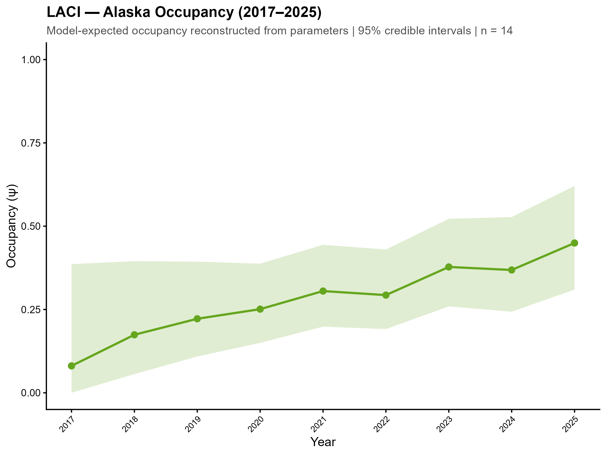 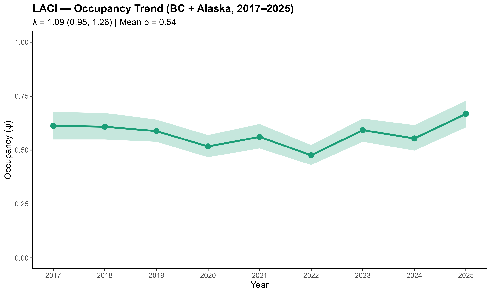 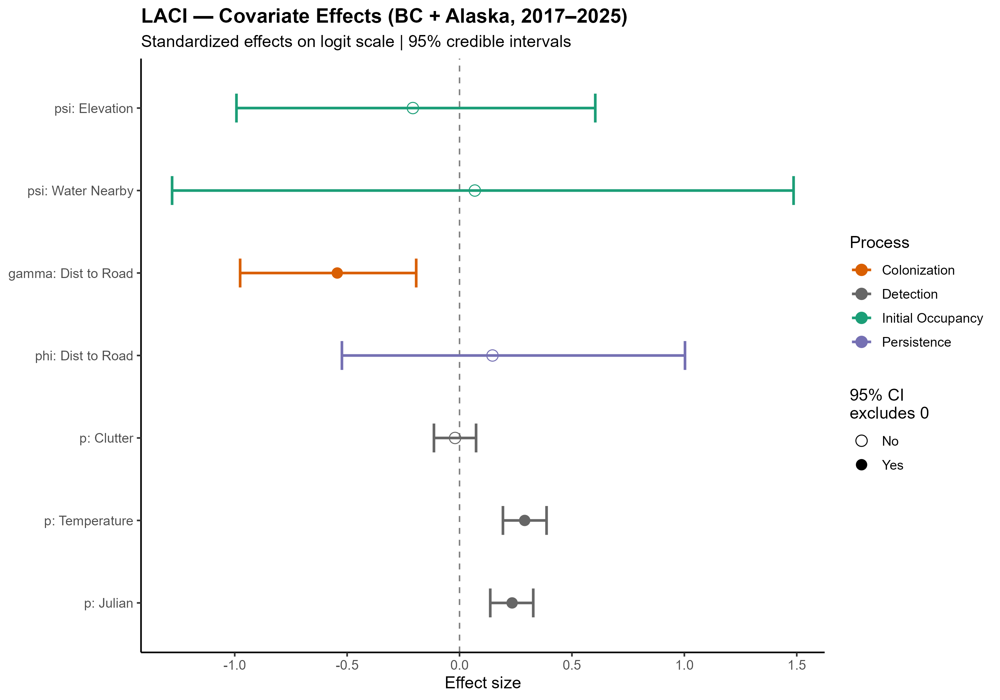 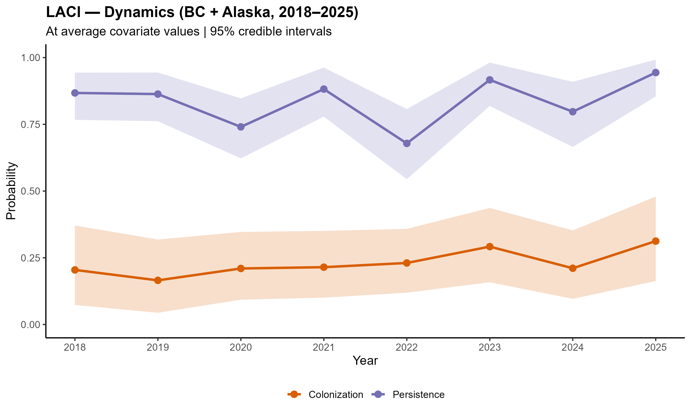

##Silver-haired Bat (*Lasyonicteris noctivagans*)

   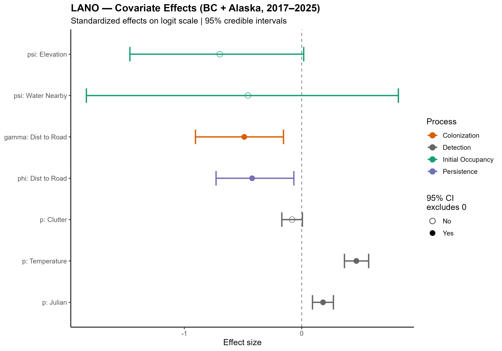

## California Myotis (*Myotis californicus*)

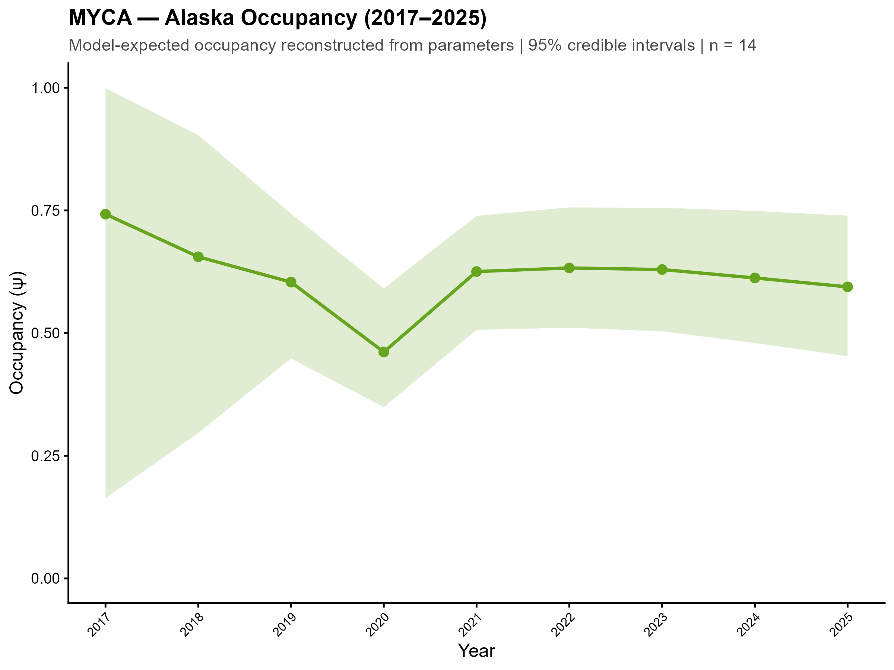  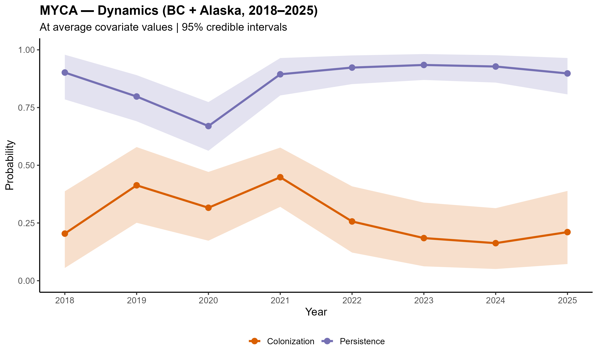 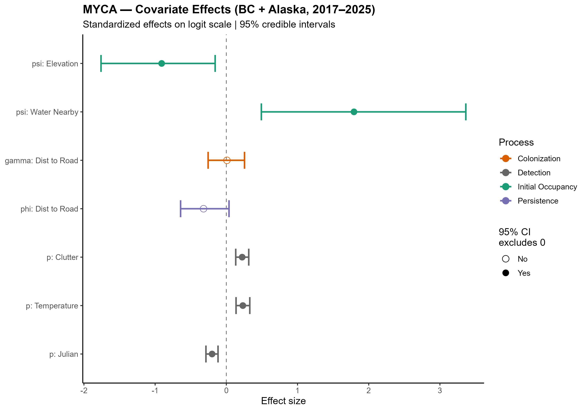

## Long-eared Myotis (*Myotis evotis*)

 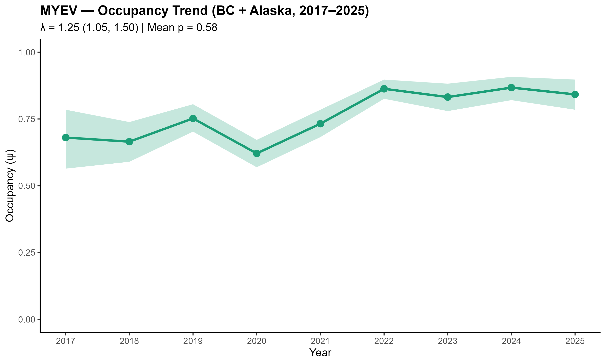  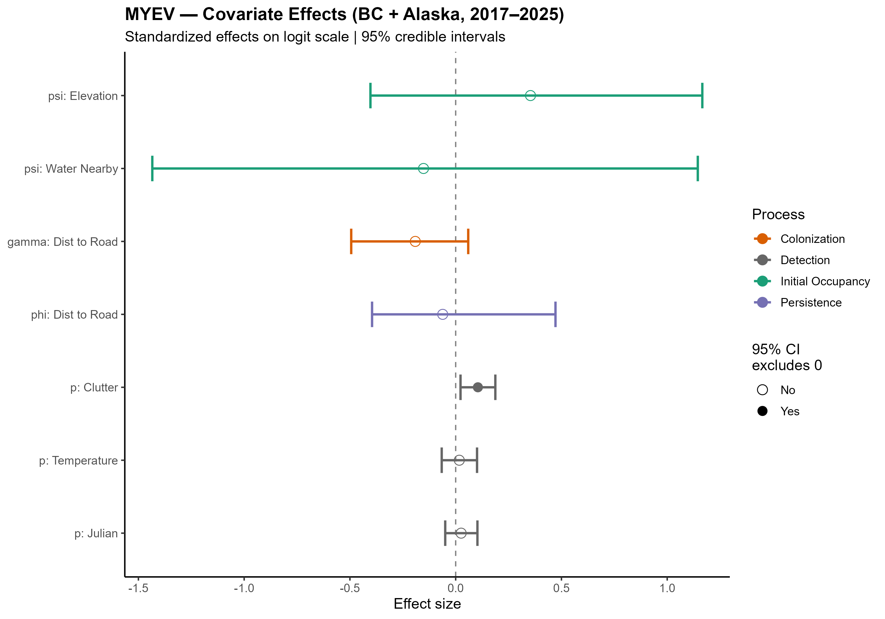

## Little Brown Myotis (*Myotis lucifugus*)

 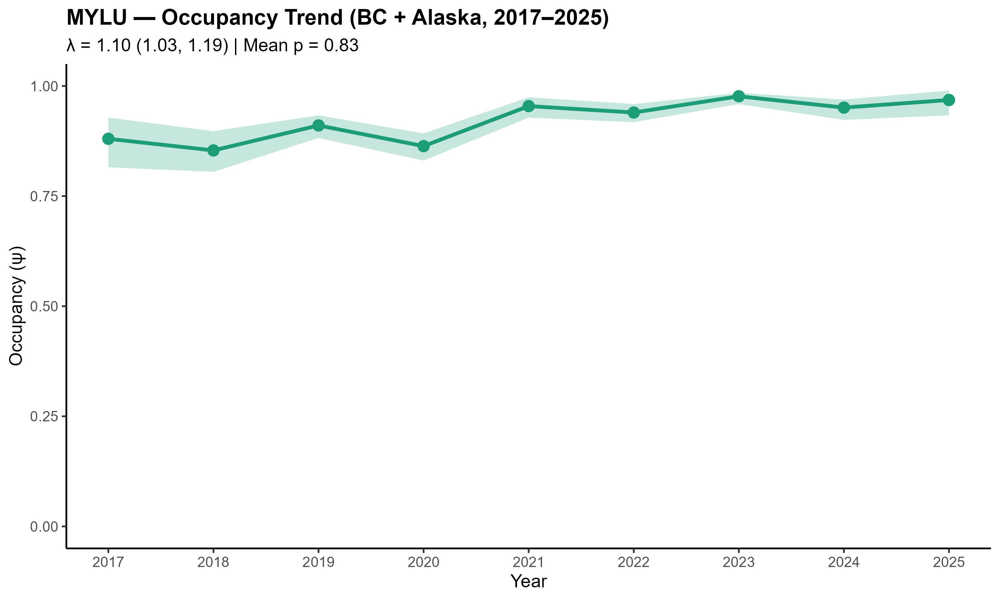  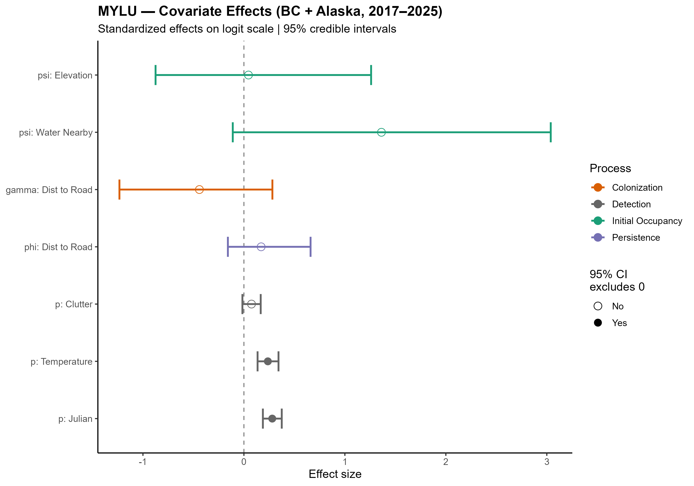

## Long-legged Myotis (*Myotis volans*)

 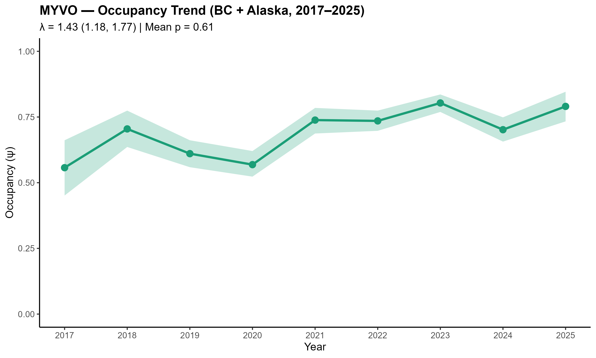 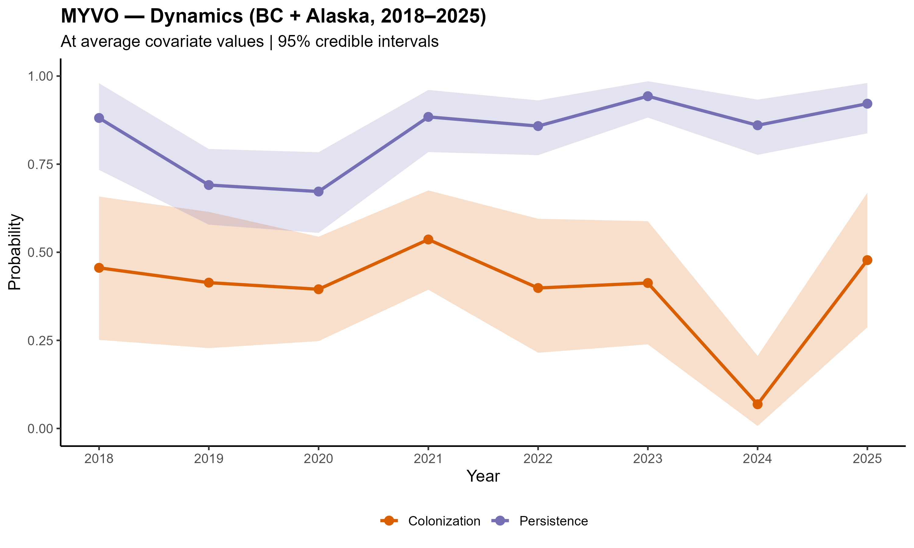 



```{r}
#| label: AppendixB
#| echo: false
#| warning: false
#| message: false
#| output: asis

# ---- Appendix B: per-site popup content, PDF only ------------------------
# Recreates the pie chart + "Mean detections by date" chart from the map
# popups, screenshots each with webshot2, one site per subsection.
if (is_pdf) {
  
  appx_dir <- "Figures/AppendixB"
  if (!dir.exists(appx_dir)) dir.create(appx_dir, recursive = TRUE)
  
  # ---- Assign each site to a GRTS cell by the polygon its point falls in ----
  pts_sf    <- sf::st_as_sf(map_data, coords = c("Long", "Lat"), crs = 4326, remove = FALSE)
  cell_join <- sf::st_join(pts_sf, grids["GRTS_ID"], left = TRUE)
  md        <- sf::st_drop_geometry(cell_join)          # map_data cols + GRTS_ID
  
  cell_lookup <- md[, c("Site_key", "GRTS_ID")]
  site_names  <- md[, c("Site_key", "Site")]
  
  sd_all <- site_day %>%
    dplyr::left_join(cell_lookup, by = "Site_key") %>%
    dplyr::left_join(site_names,  by = "Site_key")
  
  pts_all <- df_pts %>%
    dplyr::select(-SiteName) %>%                            # drop raw (all-caps) name
    dplyr::left_join(cell_lookup, by = "Site_key") %>%
    dplyr::left_join(site_names,  by = "Site_key")
  
  site_palette <- c("#e41a1c", "#377eb8", "#4daf4a", "#984ea3",
                    "#ff7f00", "#a65628", "#f781bf", "#666666")
  
  cells <- sort(unique(md$GRTS_ID[!is.na(md$GRTS_ID)]))
  
  pie_html <- pie_png <- bar_html <- bar_png <- hr_html <- hr_png <- cell_tag <- character(0)
  
  for (cell in cells) {
    cell_sites <- sort(unique(md$Site[!is.na(md$GRTS_ID) & md$GRTS_ID == cell]))
    if (length(cell_sites) == 0) next
    cols <- setNames(site_palette[((seq_along(cell_sites) - 1) %% length(site_palette)) + 1], cell_sites)
    tag  <- gsub("[^A-Za-z0-9]+", "_", as.character(cell))
    
    # Page 1: one titled pie per site
    pie_items <- vapply(cell_sites, function(s) {
      counts <- setNames(as.numeric(unlist(map_data[map_data$Site == s, target_species])), target_species)
      sprintf('<div class="pieItem"><div class="pieTitle">%s</div>%s</div>', htmltools::htmlEscape(s), make_pie_svg(counts))
    }, character(1))
    pies_page <- sprintf('<!DOCTYPE html><html><head><meta charset="utf-8"><style>body{margin:0;padding:12px;background:#fff;}#pies{width:740px;}.pieItem{display:inline-block;vertical-align:top;text-align:center;margin:8px;}.pieTitle{font-family:sans-serif;font-weight:bold;font-size:14px;color:#2c3e50;margin-bottom:2px;}</style></head><body><div id="pies">%s</div></body></html>',
                         paste(pie_items, collapse = ""))
    
    # Page 2: combined bar (site-coloured)
    sd_cell  <- sd_all[!is.na(sd_all$GRTS_ID) & sd_all$GRTS_ID == cell, ]
    bar_svg  <- make_multisite_dayseries_svg(sd_cell, cols, width = 700L, height = 360L)
    bar_page <- sprintf('<!DOCTYPE html><html><head><meta charset="utf-8"><style>body{margin:0;padding:12px;background:#fff;}#bar{display:inline-block;}</style></head><body><div id="bar">%s</div></body></html>', bar_svg)
    
    # Page 3: combined hour facets (site-coloured dots)
    pts_cell <- pts_all[!is.na(pts_all$GRTS_ID) & pts_all$GRTS_ID == cell, ]
    hr_svg   <- make_hourfacet_svg(pts_cell, ylim = hour_ylim, site_cols = cols,
                                   width = 700L, panel_h = 380L, panel_gap = 6L,
                                   ml = 44L, mr = 10L, strip_h = 17L, point_r = 2.6, font_size = 11L)
    hr_page  <- sprintf('<!DOCTYPE html><html><head><meta charset="utf-8"><style>body{margin:0;padding:12px;background:#fff;}#hr{display:inline-block;}</style></head><body><div id="hr">%s</div></body></html>', hr_svg)
    
    ph <- normalizePath(file.path(appx_dir, paste0(tag, "_pies.html")), mustWork = FALSE)
    bh <- normalizePath(file.path(appx_dir, paste0(tag, "_bar.html")),  mustWork = FALSE)
    hh <- normalizePath(file.path(appx_dir, paste0(tag, "_hour.html")), mustWork = FALSE)
    writeLines(pies_page, ph); writeLines(bar_page, bh); writeLines(hr_page, hh)
    
    pie_html <- c(pie_html, ph); pie_png <- c(pie_png, file.path(appx_dir, paste0(tag, "_pies.png")))
    bar_html <- c(bar_html, bh); bar_png <- c(bar_png, file.path(appx_dir, paste0(tag, "_bar.png")))
    hr_html  <- c(hr_html,  hh); hr_png  <- c(hr_png,  file.path(appx_dir, paste0(tag, "_hour.png")))
    cell_tag <- c(cell_tag, as.character(cell))
  }
  
  invisible(utils::capture.output(suppressMessages({
    if (length(pie_html)) webshot2::webshot(url = pie_html, file = pie_png, selector = "#pies", zoom = 3)
    if (length(bar_html)) webshot2::webshot(url = bar_html, file = bar_png, selector = "#bar",  zoom = 2)
    if (length(hr_html))  webshot2::webshot(url = hr_html,  file = hr_png,  selector = "#hr",   zoom = 2)
  })))
  
  cat("# Appendix B\n\n")
  cat("2025 Species detection summaries by GRTS cell.\n\n")
  for (k in seq_along(cell_tag)) {
    if (k > 1) cat("\n\\newpage\n\n")
    cat(sprintf("## Grid cell %s {.unnumbered .unlisted}\n\n", cell_tag[k]))
    cat(sprintf("{width=100%%}\n\n", pie_png[k]))
    cat("\n\\newpage\n\n")
    cat(sprintf("{width=100%%}\n\n", cell_tag[k], bar_png[k]))
    cat("\n\\newpage\n\n")
    cat(sprintf("{width=100%%}\n\n", cell_tag[k], hr_png[k]))
  }
}
```



# Literature Cited
